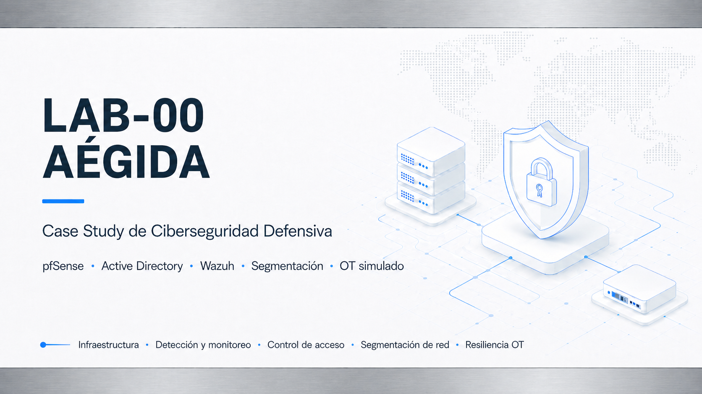

# LAB-00 — AÉGIDA Case Study

## Descripción

**AÉGIDA** es un case study de ciberseguridad defensiva basado en una infraestructura segmentada, monitorizada y administrada con criterios de seguridad.

El laboratorio integra firewall perimetral, Active Directory, administración privilegiada, DMZ, monitorización con Wazuh, red OT simulada y validaciones técnicas controladas desde una red no confiable.

Forma parte de un **portfolio técnico documentado** orientado a sistemas, infraestructura, seguridad defensiva, operación IT y cloud.

---

## Objetivos

- Diseñar una arquitectura defensiva segmentada por zonas.
- Centralizar el control de tráfico mediante pfSense.
- Separar identidad, administración, DMZ, SOC, OT y red de pruebas.
- Administrar activos críticos desde una PAW.
- Aplicar controles básicos mediante GPOs y modelo Tier 0.
- Desplegar Wazuh como plataforma SOC/SIEM de laboratorio.
- Validar aislamiento y contención frente a una red no confiable.
- Documentar arquitectura, evidencias, decisiones técnicas y limitaciones.

---

## Arquitectura resumida

| Zona | Subred | Función |
|---|---:|---|
| WAN | `192.168.139.0/24` | Salida exterior mediante NAT de VMware. |
| DMZ | `192.168.10.0/24` | Servicio web controlado con Nginx. |
| MGMT | `192.168.20.0/24` | Administración segura desde PAW. |
| TIER0 | `192.168.30.0/24` | Active Directory, DNS y activos críticos. |
| SOC | `192.168.40.0/24` | Wazuh/SIEM y monitorización. |
| OT | `192.168.50.0/24` | PLC/HMI simulados. |
| TRANSIT-LAB | `192.168.60.0/24` | Enlace hacia entorno OT remoto. |
| RED-KALI | `192.168.70.0/24` | Red no confiable para validaciones controladas. |

---

## Componentes principales

| Componente | Rol |
|---|---|
| `AEGIDA-PF-FW` | Firewall pfSense, gateway y control de tráfico entre zonas. |
| `AEGIDA-DC01` | Controlador de dominio, DNS y base del segmento Tier 0. |
| `AEGIDA-PAW01` | Estación privilegiada de administración. |
| `AEGIDA-SRV-DMZ01` | Servidor Ubuntu/Nginx en DMZ. |
| `AEGIDA-SOC-WAZUH01` | Plataforma Wazuh all-in-one. |
| `AEGIDA-OT-PLC01` | PLC simulado en red OT. |
| `AEGIDA-OT-HMI01` | HMI simulada en red OT. |
| `AEGIDA-RED-KALI01` | Kali Linux para pruebas ofensivo-defensivas controladas. |

---

## Evidencias destacadas

- Topología lógica global.
- Segmentación VMware por VMnet.
- pfSense como firewall central.
- Active Directory y modelo Tier 0.
- PAW como estación de administración segura.
- GPOs y hardening básico.
- Nginx en DMZ.
- Validación DNS.
- Wazuh con agentes activos.
- FIM en activos OT.
- Bloqueo de RED-KALI hacia OT.
- Playbook básico SOC.

Galería completa: [evidencias.md](evidencias.md).

---

## Documentación

| Documento | Contenido |
|---|---|
| [Arquitectura](arquitectura.md) | Diseño de zonas, redes, máquinas, flujos y limitaciones. |
| [Tecnologías](tecnologias.md) | Stack utilizado y función de cada herramienta. |
| [Evidencias](evidencias.md) | Capturas y diagramas seleccionados con valor técnico. |
| [Explicación técnica](defensa.md) | Resumen defendible del caso de estudio. |
| [Competencias técnicas](valor-profesional.md) | Valor profesional y roles relacionados. |
| [Lecciones aprendidas](lecciones-aprendidas.md) | Incidencias, aprendizaje y mejoras futuras. |
| [Resumen profesional](resumen-cv.md) | Versión breve para CV/LinkedIn. |

---

## Valor profesional

Este case study demuestra competencias en:

- Administración de sistemas Windows y Linux.
- Diseño de redes segmentadas.
- Seguridad perimetral con firewall.
- Active Directory, DNS, OUs, GPOs y Tier 0.
- Administración privilegiada mediante PAW.
- Monitorización defensiva con Wazuh.
- Integración básica de entorno OT simulado.
- Validación defensiva desde red no confiable.
- Documentación técnica con evidencias.

---

## Limitaciones reconocidas

- Entorno virtualizado local, no producción real.
- Wazuh desplegado en modo all-in-one.
- OT simulado, no PLC físico real.
- Sin alta disponibilidad en pfSense ni segundo controlador de dominio.
- Pruebas ofensivas limitadas y controladas.

Estas limitaciones se documentan para mantener el case study realista y defendible.

---

## Estado final

LAB-00 queda cerrado como **completado v1** dentro del portfolio técnico.

Su función es actuar como laboratorio fundacional de ciberseguridad defensiva, segmentación, identidad, administración segura y monitorización, complementando los laboratorios posteriores de SQL Server, alta disponibilidad y operación IT.
