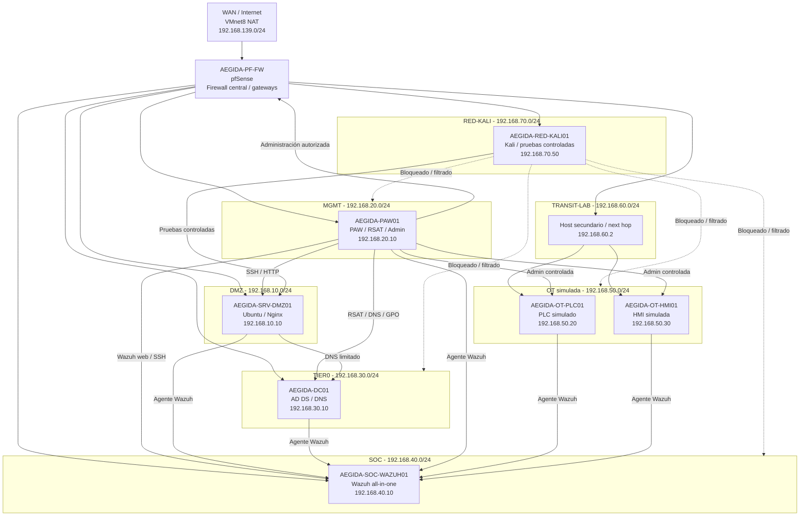

# Arquitectura — LAB-00 AÉGIDA Case Study

## 1. Visión general

AÉGIDA es una arquitectura virtualizada de ciberseguridad defensiva basada en segmentación por zonas, control perimetral, administración segura, identidad centralizada, monitorización SOC y validación ofensivo-defensiva controlada.

El diseño reproduce un entorno corporativo/industrial dividido en áreas funcionales:

- Servicios expuestos en DMZ.
- Administración segura desde una PAW.
- Servicios críticos de identidad en TIER0.
- Monitorización centralizada en SOC.
- Entorno OT simulado con HMI/PLC.
- Red atacante controlada con Kali Linux.
- Enlace TRANSIT-LAB para integrar el host secundario.

El firewall **AEGIDA-PF-FW**, basado en pfSense, actúa como núcleo de segmentación, gateway de las redes internas y punto central de control del tráfico.

---

## 2. Principios de diseño

| Principio | Aplicación en AÉGIDA |
|---|---|
| Segmentación | Separación de redes por función y criticidad. |
| Mínimo privilegio | Solo se permiten flujos necesarios y justificados. |
| Defensa en profundidad | Firewall, AD, GPOs, PAW, Wazuh y validaciones defensivas. |
| Administración segura | Gestión centralizada desde AEGIDA-PAW01. |
| Visibilidad | Monitorización mediante Wazuh, logs y evidencias. |
| Trazabilidad | Documentación de pruebas, incidencias y decisiones. |
| Contención | RED-KALI no tiene acceso libre a segmentos críticos. |

---

## 3. Zonas de red

| Zona | Subred | Gateway | Función |
|---|---:|---:|---|
| WAN | 192.168.139.0/24 | DHCP VMware NAT | Salida exterior del firewall. |
| DMZ | 192.168.10.0/24 | 192.168.10.1 | Servicio web controlado. |
| MGMT | 192.168.20.0/24 | 192.168.20.1 | Administración segura. |
| TIER0 | 192.168.30.0/24 | 192.168.30.1 | Controlador de dominio y DNS. |
| SOC | 192.168.40.0/24 | 192.168.40.1 | Wazuh/SIEM. |
| OT | 192.168.50.0/24 | 192.168.50.1 | PLC/HMI simulados. |
| TRANSIT-LAB | 192.168.60.0/24 | 192.168.60.1 / 192.168.60.2 | Enlace entre host principal y secundario. |
| RED-KALI | 192.168.70.0/24 | 192.168.70.1 | Red atacante controlada. |

---

## 4. Correspondencia VMware / segmentos

| Red lógica | VMware | Tipo | Subred |
|---|---|---|---:|
| WAN | VMnet8 | NAT | 192.168.139.0/24 |
| DMZ | VMnet2 | Host-only | 192.168.10.0/24 |
| MGMT | VMnet3 | Host-only | 192.168.20.0/24 |
| TIER0 | VMnet4 | Host-only | 192.168.30.0/24 |
| SOC | VMnet5 | Host-only | 192.168.40.0/24 |
| OT | VMnet6 | Host-only en host secundario | 192.168.50.0/24 |
| TRANSIT-LAB | VMnet0 / enlace físico | Bridge dedicado | 192.168.60.0/24 |
| RED-KALI | VMnet7 | Host-only / personalizada | 192.168.70.0/24 |

---

## 5. Inventario de máquinas

| Máquina | Sistema / rol | Red | IP |
|---|---|---|---:|
| AEGIDA-PF-FW | pfSense / firewall central | Varias | Gateways de cada segmento. |
| AEGIDA-DC01 | Windows Server 2022 / AD DS + DNS | TIER0 | 192.168.30.10 |
| AEGIDA-PAW01 | Windows 11 Pro / PAW | MGMT | 192.168.20.10 |
| AEGIDA-SRV-DMZ01 | Ubuntu Server / Nginx | DMZ | 192.168.10.10 |
| AEGIDA-SOC-WAZUH01 | Ubuntu Server / Wazuh all-in-one | SOC | 192.168.40.10 |
| AEGIDA-OT-PLC01 | Ubuntu Server / PLC simulado | OT | 192.168.50.20 |
| AEGIDA-OT-HMI01 | Ubuntu Server / HMI simulada | OT | 192.168.50.30 |
| AEGIDA-RED-KALI01 | Kali Linux / pruebas controladas | RED-KALI | 192.168.70.50 |

---

## 6. Diagrama lógico en imagen


El diagrama lógico resume las zonas de red principales, el firewall central pfSense y los segmentos defensivos del laboratorio.

---

## 7. Esquema lógico Mermaid



---

## 8. Firewall central: AEGIDA-PF-FW

AEGIDA-PF-FW es el componente principal de control de tráfico del laboratorio.

Funciones principales:

- Gateway de los segmentos internos.
- Firewall entre zonas.
- Control de acceso por origen, destino y puerto.
- Segmentación entre DMZ, MGMT, TIER0, SOC, OT y RED-KALI.
- Ruta estática hacia el entorno OT remoto.
- Registro de tráfico permitido y bloqueado.
- Contención de intentos no autorizados desde RED-KALI.

Interfaces principales:

| Interfaz | Zona | IP |
|---|---|---:|
| WAN | WAN / Internet | DHCP en 192.168.139.0/24 |
| LAN / MGMT | MGMT | 192.168.20.1 |
| OPT1 | DMZ | 192.168.10.1 |
| OPT2 | TIER0 | 192.168.30.1 |
| OPT3 | SOC | 192.168.40.1 |
| TRANSITLAB | TRANSIT-LAB | 192.168.60.1 |
| REDKALI | RED-KALI | 192.168.70.1 |

Nota: el entorno OT se alcanza como red remota mediante ruta estática, no como interfaz OT directa activa final.

---

## 9. Ruta hacia OT remoto

El entorno OT se aloja en un host secundario para reducir carga sobre el host principal.

```text
Ruta estática en pfSense:
192.168.50.0/24 vía 192.168.60.2
```

| Elemento | IP / red | Función |
|---|---:|---|
| pfSense TRANSITLAB | 192.168.60.1 | Extremo firewall del tránsito. |
| Host secundario | 192.168.60.2 | Siguiente salto hacia OT. |
| OT | 192.168.50.0/24 | Red industrial simulada. |
| PLC01 | 192.168.50.20 | Activo industrial simulado. |
| HMI01 | 192.168.50.30 | Interfaz de supervisión simulada. |

---

## 10. Modelo de identidad: Active Directory / TIER0

El dominio del laboratorio es:

```text
aegida.local
```

El controlador de dominio principal es:

```text
AEGIDA-DC01 — 192.168.30.10
```

Funciones principales:

- Active Directory Domain Services.
- DNS interno.
- Resolución directa e inversa.
- Organización lógica mediante OUs.
- Separación de cuentas administrativas.
- Base para aplicación de GPOs.
- Protección del ámbito Tier 0.

---

## 11. Administración segura: PAW

La máquina **AEGIDA-PAW01** actúa como estación privilegiada de administración.

```text
AEGIDA-PAW01 — 192.168.20.10
```

Funciones:

- Administración de Active Directory mediante RSAT.
- Gestión DNS.
- Gestión de GPOs.
- Acceso web a pfSense.
- Acceso web a Wazuh.
- Administración SSH de sistemas Linux mediante MobaXterm.
- Diagnóstico de red con PowerShell y Wireshark.
- Punto autorizado para administrar activos críticos.

La administración desde RED-KALI queda bloqueada o filtrada.

---

## 12. DMZ

La DMZ aloja el servidor:

```text
AEGIDA-SRV-DMZ01 — 192.168.10.10
```

Función:

- Servidor Ubuntu Server.
- Servicio web Nginx.
- Publicación controlada de contenido.
- Validación de acceso HTTP desde orígenes autorizados.
- Escenario de reconocimiento web controlado desde RED-KALI.

La DMZ no tiene acceso libre a segmentos críticos. Sus comunicaciones se limitan mediante reglas explícitas en pfSense.

---

## 13. SOC / Wazuh

El nodo de monitorización es:

```text
AEGIDA-SOC-WAZUH01 — 192.168.40.10
```

Funciones:

- Plataforma Wazuh all-in-one.
- Monitorización de agentes.
- Revisión de eventos.
- File Integrity Monitoring.
- Visibilidad sobre endpoints críticos.
- Apoyo a respuesta ante incidentes.
- Evidencias SOC durante validaciones defensivas.

Agentes integrados:

| Agente | Función |
|---|---|
| AEGIDA-SRV-DMZ01 | Servidor DMZ. |
| AEGIDA-DC01 | Controlador de dominio. |
| AEGIDA-PAW01 | Estación privilegiada. |
| AEGIDA-OT-PLC01 | PLC simulado. |
| AEGIDA-OT-HMI01 | HMI simulada. |

---

## 14. Entorno OT simulado

El entorno OT representa una pequeña red industrial simulada.

| Máquina | IP | Función |
|---|---:|---|
| AEGIDA-OT-PLC01 | 192.168.50.20 | PLC simulado. |
| AEGIDA-OT-HMI01 | 192.168.50.30 | HMI simulada. |

Características:

- Red OT separada.
- Alojada en host secundario.
- Integrada mediante TRANSIT-LAB.
- Acceso administrativo controlado desde PAW.
- Monitorización mediante Wazuh.
- Servicios web Nginx para simular paneles de estado.

---

## 15. RED-KALI

La red atacante controlada es:

```text
RED-KALI — 192.168.70.0/24
AEGIDA-RED-KALI01 — 192.168.70.50
```

Función:

- Validar la arquitectura defensiva.
- Comprobar bloqueos hacia segmentos críticos.
- Realizar pruebas controladas contra DMZ.
- Verificar ausencia de movimiento lateral hacia OT, TIER0, SOC y MGMT.
- Generar evidencias de contención en pfSense y, cuando proceda, en Wazuh.

RED-KALI no representa una red de administración ni una red interna confiable.

---

## 16. Flujos permitidos principales

| Origen | Destino | Servicio | Justificación |
|---|---|---|---|
| PAW01 | pfSense | HTTPS / SSH | Administración del firewall. |
| PAW01 | DC01 | DNS / RSAT / administración | Gestión del dominio. |
| PAW01 | Wazuh | HTTPS / SSH | Administración SOC. |
| PAW01 | DMZ01 | SSH / HTTP | Administración y validación del servicio. |
| PAW01 | PLC01 / HMI01 | SSH / HTTP | Administración OT controlada. |
| Agentes Wazuh | Wazuh Manager | Puertos Wazuh | Monitorización. |
| DC01 | Internet | DNS/HTTP/HTTPS según reglas | Reenviadores y actualizaciones. |
| DMZ01 | DC01 | DNS | Resolución interna. |
| OT | Wazuh | Comunicación agente-manager | Monitorización de activos OT. |

---

## 17. Flujos bloqueados o restringidos

| Origen | Destino | Resultado esperado |
|---|---|---|
| RED-KALI | TIER0/DC01 | Bloqueado o filtrado. |
| RED-KALI | SOC/Wazuh | Bloqueado o filtrado. |
| RED-KALI | MGMT/PAW01 | Bloqueado o filtrado. |
| RED-KALI | OT/PLC-HMI | Bloqueado o filtrado. |
| DMZ | TIER0 sin regla explícita | Bloqueado. |
| OT | Segmentos no necesarios | Restringido. |
| Clientes no autorizados | Plano de administración | Bloqueado. |

---

## 18. Escenarios de validación defensiva

| Escenario | Objetivo |
|---|---|
| Reconocimiento web contra DMZ | Comprobar acceso controlado y visibilidad. |
| Movimiento lateral hacia OT | Validar aislamiento del entorno industrial. |
| Acceso hacia TIER0/DC01 | Proteger servicios críticos de identidad. |
| Acceso hacia SOC/Wazuh | Proteger la plataforma de monitorización. |
| Acceso hacia PAW01 | Proteger el plano de administración. |

---

## 19. Limitaciones conocidas

El laboratorio fue construido sobre recursos propios y virtualización local, por lo que presenta limitaciones razonables:

- No existe alta disponibilidad real de pfSense.
- No existe segundo controlador de dominio.
- Wazuh se despliega en modalidad all-in-one.
- El entorno OT es simulado, no físico.
- Las pruebas ofensivo-defensivas son controladas y limitadas.
- No se implementa EDR corporativo.
- No se dispone de certificados públicos.
- Las copias y recuperación quedan planteadas como mejora futura.
