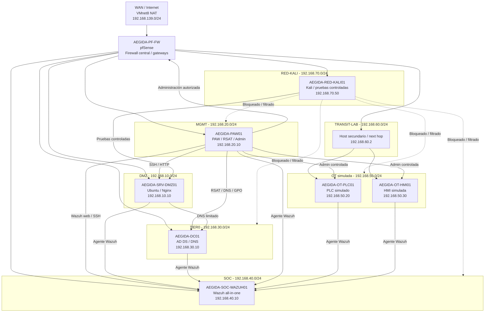

# Esquema lógico — LAB-00 AÉGIDA Case Study

## Objetivo

Añadir un esquema lógico renderizable directamente en GitHub mediante Mermaid, manteniendo las imágenes y diagramas existentes del laboratorio.

La imagen principal publicada se conserva en:

```text
diagramas/01-topologia-logica-global.png
```

## Esquema lógico Mermaid



## Lectura rápida

- pfSense actúa como núcleo de segmentación.
- La PAW concentra la administración autorizada.
- TIER0 contiene identidad y DNS.
- SOC/Wazuh aporta visibilidad defensiva.
- OT queda separada y se alcanza por TRANSIT-LAB.
- RED-KALI se usa como red no confiable para validar bloqueos y exposición controlada.
