# Evidencias — LAB-00 AÉGIDA Case Study

## 1. Objetivo del documento

Este documento recoge las evidencias técnicas principales del laboratorio **AÉGIDA**, seleccionadas desde la memoria final original del proyecto y adaptadas al formato de portfolio profesional dentro de **PROYECTO ORION**.

El objetivo no es publicar todas las capturas del proyecto original, sino mostrar una selección clara y útil que permita comprender:

- La arquitectura defensiva diseñada.
- La segmentación por zonas.
- El papel de pfSense como firewall central.
- La integración de Active Directory, DNS, PAW, Wazuh, DMZ, OT y RED-KALI.
- Las validaciones defensivas realizadas.
- La existencia de monitorización, FIM, reglas de firewall y playbook SOC.

Las imágenes incluidas en este repositorio son evidencias extraídas y renombradas para facilitar su lectura en GitHub.

---

## 2. Evidencias visuales incorporadas

| Nº | Evidencia | Archivo |
|---:|---|---|
| 1 | Topología lógica global | `diagramas/01-topologia-logica-global.png` |
| 2 | Redes VMware y segmentos | `diagramas/02-redes-vmware-segmentos.png` |
| 3 | pfSense como núcleo de segmentación | `diagramas/03-pfsense-segmentacion.png` |
| 4 | Active Directory y modelo Tier 0 | `diagramas/04-active-directory-tier0.png` |
| 5 | PAW como estación de administración segura | `diagramas/05-paw-administracion-segura.png` |
| 6 | GPOs y hardening básico | `diagramas/06-gpos-hardening.png` |
| 7 | Servicio Nginx en DMZ | `capturas/dmz/nginx-dmz01.png` |
| 8 | Validación DNS | `capturas/ad/dns-validacion.png` |
| 9 | Wazuh con agentes activos | `capturas/wazuh/dashboard-agentes-activos.png` |
| 10 | Entorno OT integrado mediante TRANSIT-LAB | `diagramas/07-ot-transit-lab.png` |
| 11 | RED-KALI como red no confiable | `diagramas/08-red-kali.png` |
| 12 | Reglas pfSense para administración | `capturas/pfsense/reglas-mgmt.png` |
| 13 | FIM / Wazuh en activos OT | `capturas/wazuh/fim-ot.png` |
| 14 | Bloqueo de RED-KALI hacia OT | `capturas/kali/bloqueo-ot.png` |
| 15 | Playbook básico SOC | `diagramas/09-playbook-soc.png` |

---

## 3. Topología lógica global

La topología lógica global muestra la arquitectura completa de AÉGIDA y resume los principales segmentos del laboratorio: WAN, DMZ, MGMT, TIER0, SOC, OT, TRANSIT-LAB y RED-KALI.

Esta evidencia permite ver de forma rápida cómo se organiza el entorno y qué papel ocupa cada componente dentro del diseño defensivo.

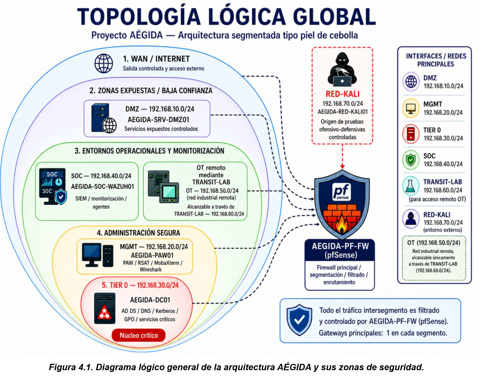

**Valor técnico:** demuestra que el laboratorio no es una colección aislada de máquinas, sino una arquitectura segmentada con funciones diferenciadas por zona.

---

## 4. Redes VMware y segmentos

Esta evidencia muestra la correspondencia entre redes VMware, subredes y segmentos funcionales del laboratorio.

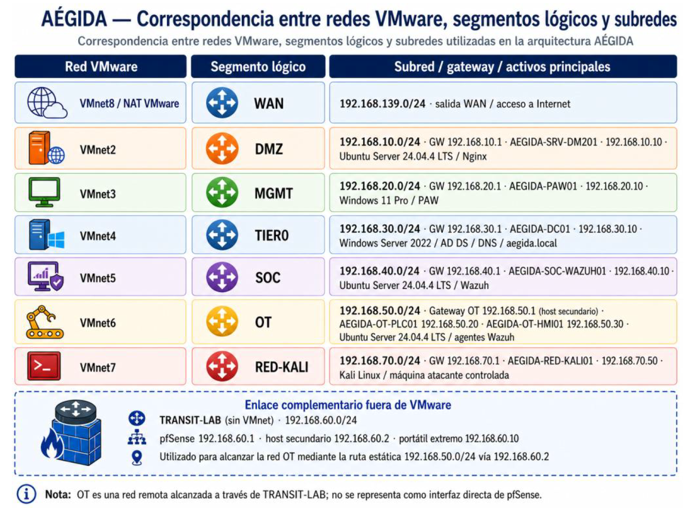

**Valor técnico:** permite justificar el diseño de red, la separación entre segmentos y el uso de VMnet específicas para simular una infraestructura corporativa/industrial.

---

## 5. pfSense como núcleo de segmentación

pfSense actúa como firewall central, gateway de las redes internas y punto de control del tráfico entre zonas.

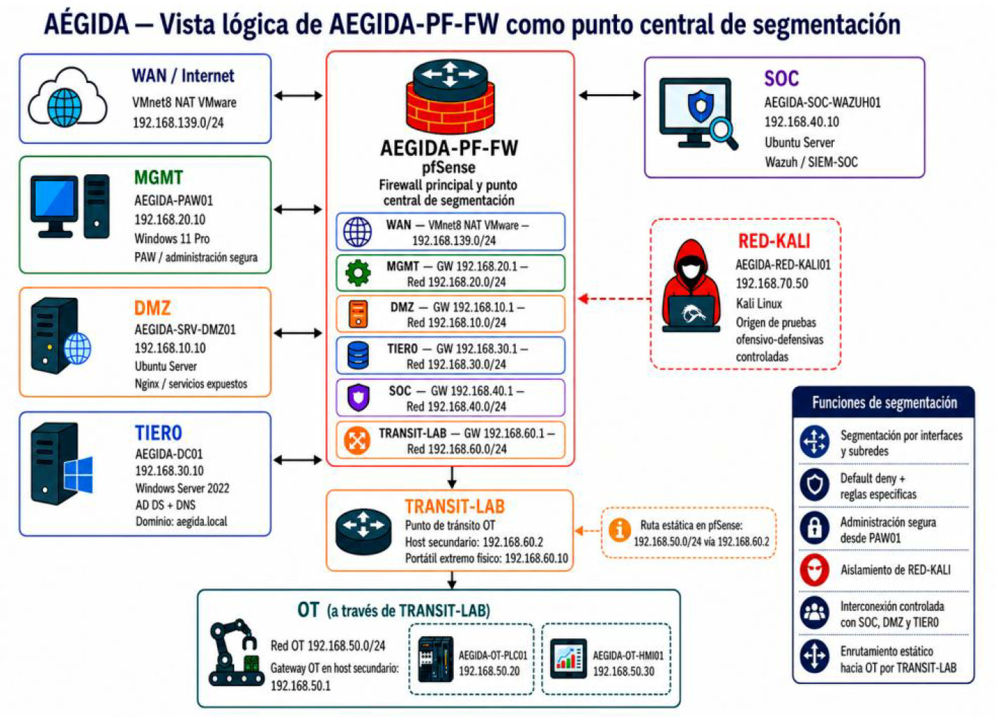

**Valor técnico:** demuestra el enfoque de seguridad perimetral y segmentación mediante reglas, interfaces, rutas y control de comunicaciones.

---

## 6. Active Directory y modelo Tier 0

El dominio `aegida.local` se apoya en Active Directory y DNS, con una estructura lógica orientada a separar activos críticos, cuentas administrativas y equipos privilegiados.

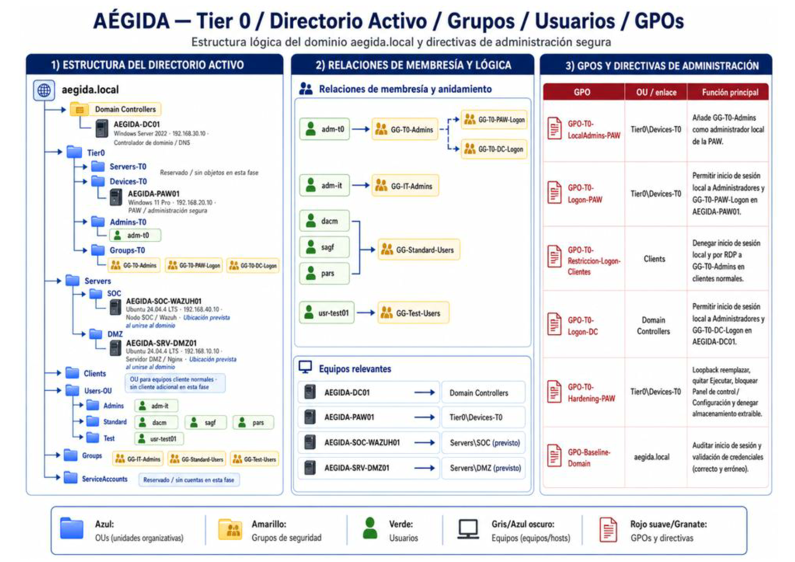

**Valor técnico:** muestra competencias en administración Microsoft, identidad centralizada, organización mediante OUs, grupos, usuarios y modelo de protección Tier 0.

---

## 7. PAW como estación de administración segura

La PAW centraliza la administración legítima del laboratorio y evita que la gestión de activos críticos se realice desde redes no confiables.

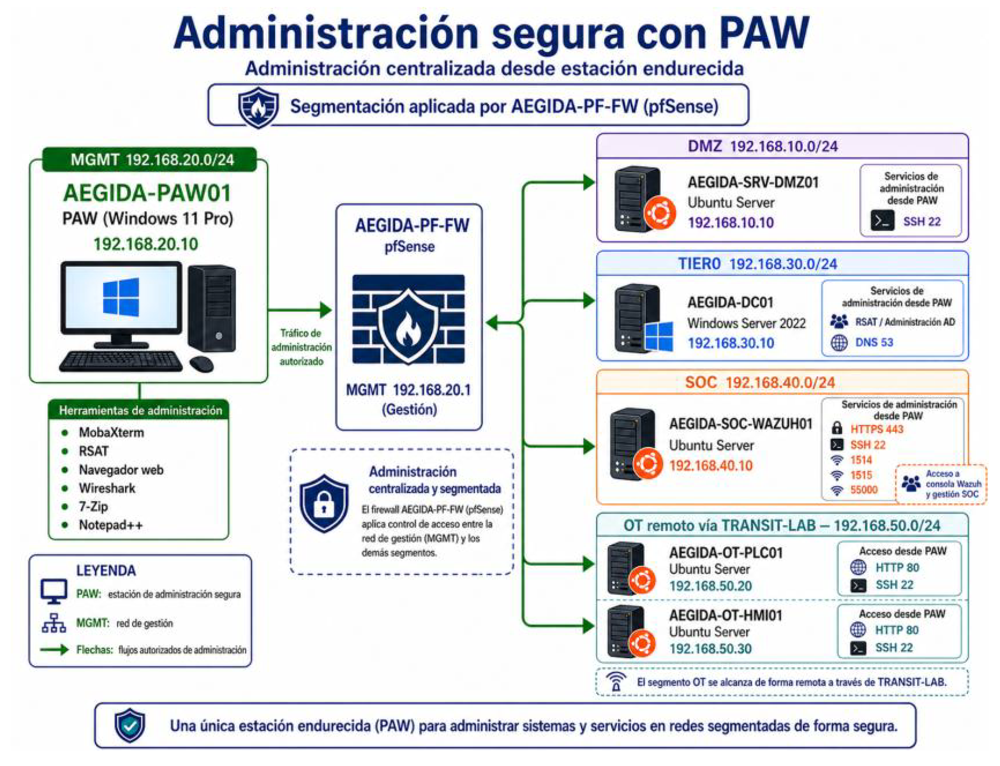

**Valor técnico:** refuerza el enfoque de administración privilegiada, separación de funciones y control del plano administrativo.

---

## 8. GPOs y hardening básico

Las GPOs aplicadas permiten convertir el diseño lógico de seguridad en restricciones reales dentro del dominio.

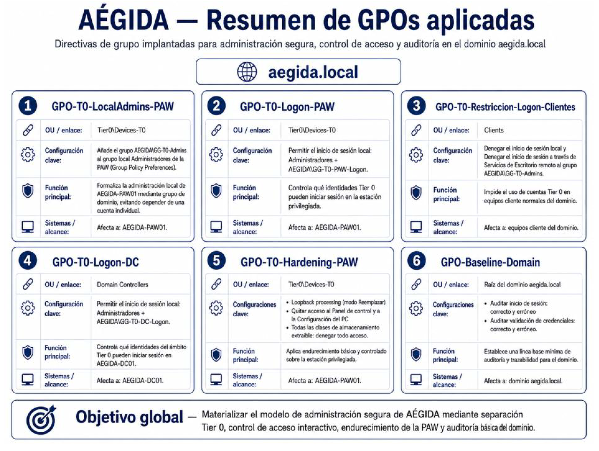

**Valor técnico:** evidencia el uso de políticas de grupo para controlar inicios de sesión, administración local, restricciones de cuentas Tier 0, hardening básico y auditoría mínima.

---

## 9. Servicio Nginx en DMZ

El servidor DMZ publica un servicio web controlado mediante Nginx, situado en un segmento separado de los activos críticos.

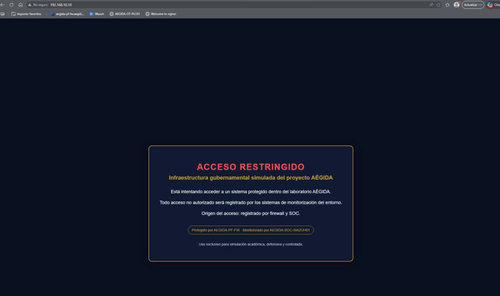

**Valor técnico:** demuestra la existencia de una DMZ funcional y separada, preparada para pruebas controladas y administración desde un origen autorizado.

---

## 10. Validación DNS

Esta evidencia muestra la validación de resolución DNS interna y externa dentro del laboratorio, apoyada en el controlador de dominio `AEGIDA-DC01`.

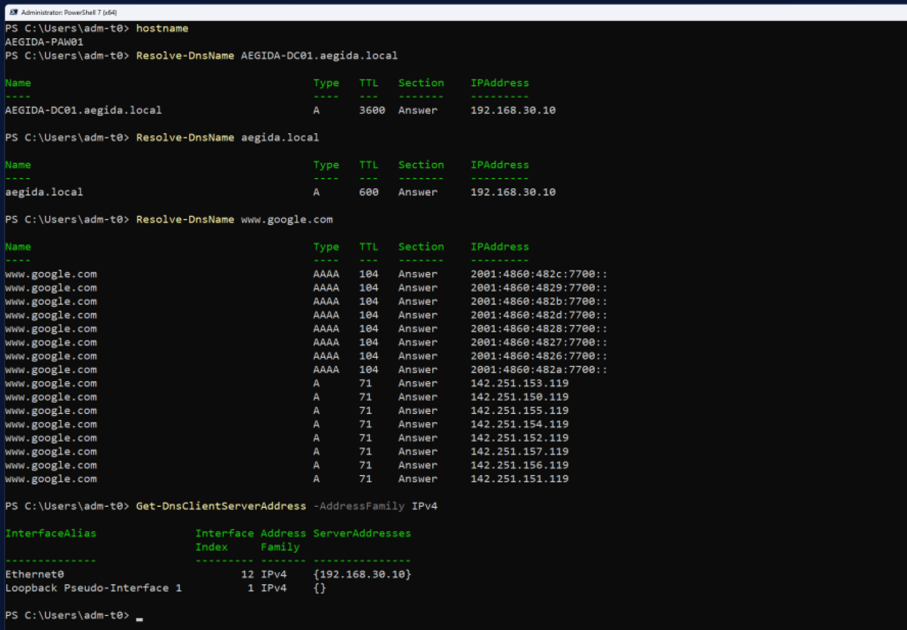

**Valor técnico:** confirma que la arquitectura no solo está segmentada, sino que también dispone de servicios base funcionales para identidad, nombres y operación diaria.

---

## 11. Wazuh con agentes activos

Wazuh funciona como plataforma SOC/SIEM del laboratorio, con agentes integrados en activos representativos de distintas zonas.

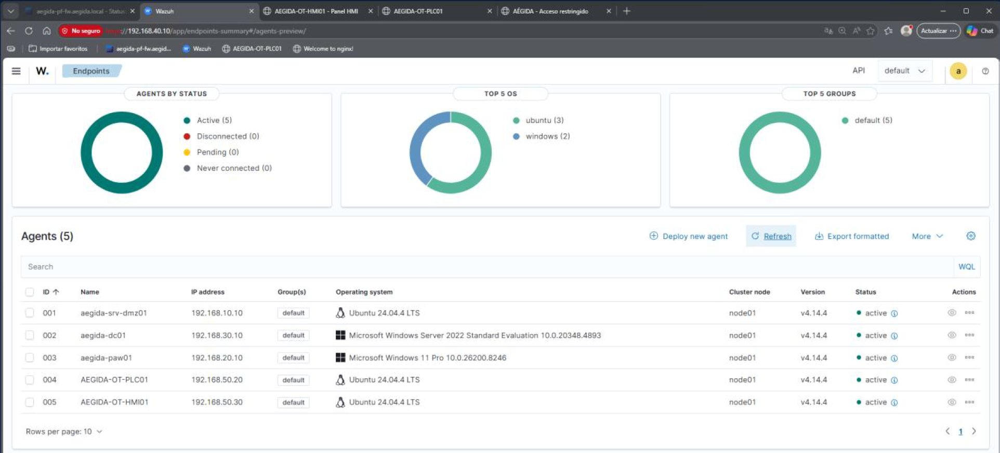

Agentes monitorizados:

| Agente | Segmento | Función |
|---|---|---|
| AEGIDA-SRV-DMZ01 | DMZ | Servidor web |
| AEGIDA-DC01 | TIER0 | Controlador de dominio |
| AEGIDA-PAW01 | MGMT | Estación administrativa |
| AEGIDA-OT-PLC01 | OT | PLC simulado |
| AEGIDA-OT-HMI01 | OT | HMI simulada |

**Valor técnico:** demuestra visibilidad defensiva, monitorización de endpoints, integración de agentes y operación básica SOC.

---

## 12. Entorno OT integrado mediante TRANSIT-LAB

El entorno OT se aloja en un host secundario y se integra en la arquitectura mediante TRANSIT-LAB y una ruta estática controlada desde pfSense.

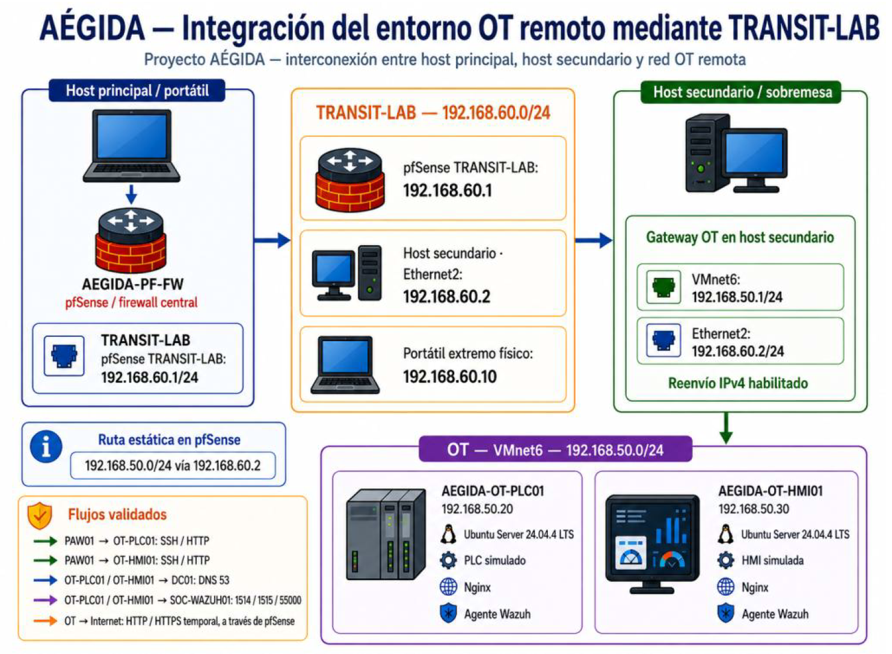

**Valor técnico:** demuestra separación IT/OT, segmentación de activos industriales simulados y capacidad para integrar redes remotas manteniendo control desde el firewall.

---

## 13. RED-KALI como red no confiable

RED-KALI representa una red atacante controlada utilizada para validar reglas, bloqueos y contención defensiva.

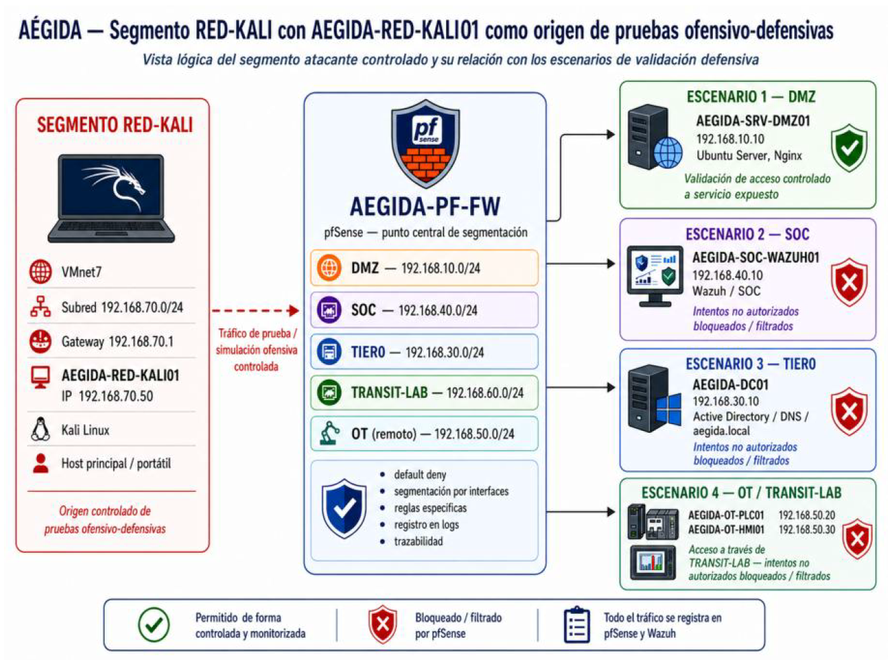

**Valor técnico:** permite comprobar que los segmentos críticos no quedan expuestos a una red no confiable y que las pruebas ofensivas tienen finalidad defensiva.

---

## 14. Reglas pfSense para administración

Esta captura evidencia reglas de pfSense relacionadas con el plano de administración y el control de tráfico entre segmentos.

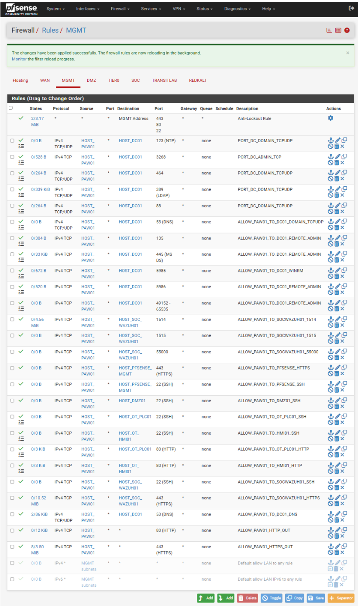

**Valor técnico:** demuestra que la segmentación no es solo conceptual, sino aplicada mediante reglas concretas de firewall.

---

## 15. FIM / Wazuh en activos OT

La evidencia FIM muestra la capacidad de Wazuh para detectar cambios controlados en ficheros monitorizados de activos OT simulados.

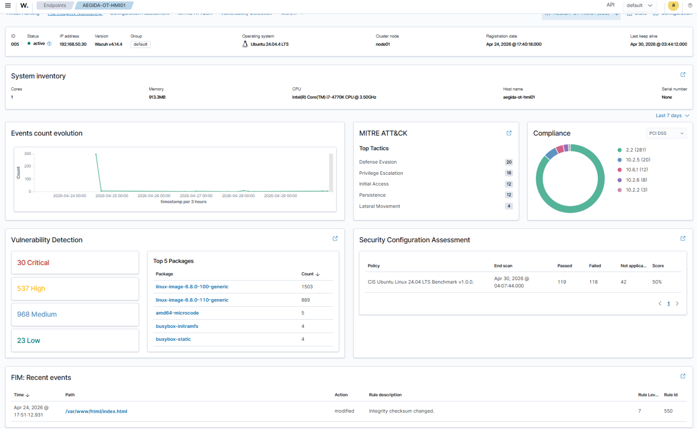

**Valor técnico:** refuerza la visibilidad defensiva sobre activos OT, demostrando detección de cambios e integridad de ficheros.

---

## 16. Bloqueo de RED-KALI hacia OT

Esta evidencia muestra la validación de aislamiento del entorno OT frente a una red no confiable.

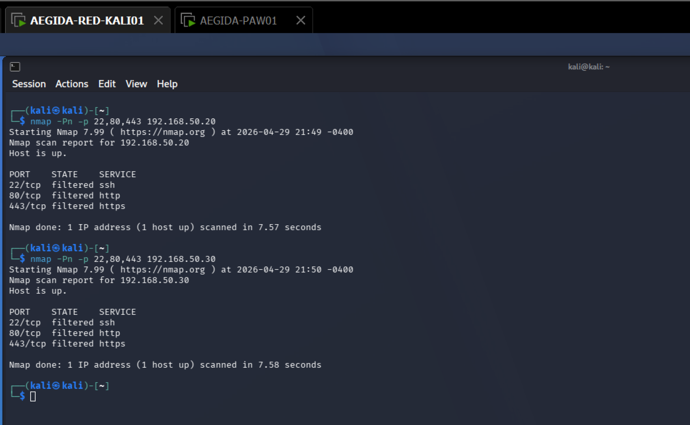

**Valor técnico:** demuestra que RED-KALI no dispone de acceso libre hacia PLC/HMI y que el entorno OT queda protegido mediante segmentación y control de tráfico.

---

## 17. Playbook básico SOC

El playbook SOC resume el flujo básico de actuación ante eventos detectados en el laboratorio.

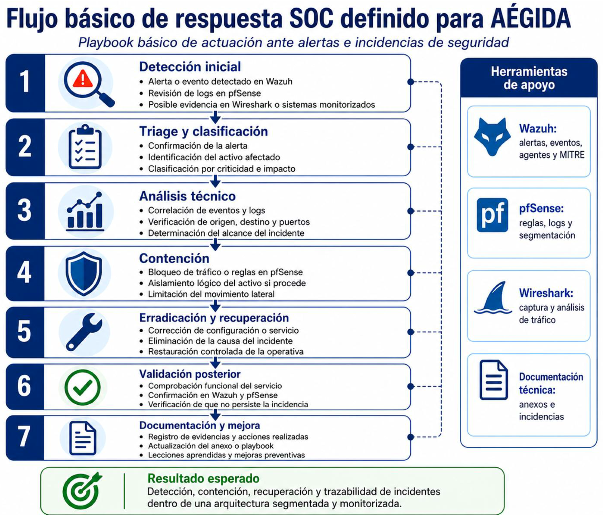

Fases principales:

| Fase | Acción |
|---|---|
| 1 | Detección inicial |
| 2 | Triaje y clasificación |
| 3 | Análisis técnico |
| 4 | Contención |
| 5 | Corrección y recuperación |
| 6 | Validación posterior |
| 7 | Documentación y mejora |

**Valor técnico:** demuestra que el laboratorio no solo despliega herramientas, sino que plantea una lógica de operación defensiva y respuesta básica ante incidentes.

---

## 18. Matriz profesional de validación

| Control | Evidencia visual | Estado |
|---|---|---|
| Arquitectura segmentada | Topología lógica global | Validado |
| Separación de redes | Redes VMware y segmentos | Validado |
| Firewall central | pfSense como núcleo de segmentación | Validado |
| Identidad y Tier 0 | Active Directory y Tier 0 | Validado |
| Administración segura | PAW | Validado |
| GPOs y hardening | Resumen de GPOs | Validado |
| DMZ funcional | Servicio Nginx en DMZ | Validado |
| DNS | Validación DNS | Validado |
| Monitorización SOC | Wazuh con agentes activos | Validado |
| Integración OT | OT mediante TRANSIT-LAB | Validado |
| Red no confiable | RED-KALI | Validado |
| Reglas de firewall | pfSense MGMT | Validado |
| Integridad de ficheros | FIM / Wazuh OT | Validado |
| Aislamiento OT | Bloqueo de RED-KALI hacia OT | Validado |
| Respuesta básica SOC | Playbook SOC | Documentado |

---

## 19. Escenarios defensivos representados

Las evidencias seleccionadas cubren los principales escenarios defensivos del laboratorio:

| Escenario | Evidencias relacionadas |
|---|---|
| Segmentación global | Topología lógica, redes VMware, pfSense |
| Protección de identidad | Active Directory, Tier 0, DNS, GPOs |
| Administración segura | PAW, reglas pfSense MGMT |
| Servicios controlados | DMZ con Nginx |
| Monitorización defensiva | Wazuh, FIM, playbook SOC |
| Seguridad OT | OT / TRANSIT-LAB, FIM OT, bloqueo desde RED-KALI |
| Validación desde red no confiable | RED-KALI, reglas pfSense, bloqueo hacia OT |

---

## 20. Criterio de selección de evidencias

Se han seleccionado evidencias que aportan valor profesional y ayudan a explicar el proyecto con claridad.

Criterios utilizados:

- Priorizar diagramas globales frente a capturas repetitivas.
- Mostrar arquitectura, no asistentes de instalación.
- Incluir evidencias de seguridad aplicada.
- Incluir pruebas defensivas y monitorización.
- Incluir servicios base relevantes como DNS y DMZ.
- Evitar publicar capturas innecesarias o demasiado académicas.
- Mantener un repositorio limpio, legible y orientado a empleabilidad.

---

## 21. Evidencias reservadas para futuras versiones

El proyecto original contiene más capturas y detalles técnicos, pero no todas se han incorporado al repositorio.

No se incluyen en esta primera versión:

- Capturas paso a paso de instalaciones.
- Capturas repetidas de configuración básica.
- Imágenes con bajo valor explicativo.
- Evidencias secundarias que sobrecargarían el repositorio.
- Capturas que convenga repetir en mejor calidad.
- El PDF completo original del proyecto.

Una evidencia candidata para una versión posterior es la validación funcional HMI/PLC con una captura más clara obtenida directamente desde las máquinas virtuales.

---

## 22. Conclusión

Las evidencias incorporadas demuestran que AÉGIDA fue diseñado, desplegado, validado y documentado como una arquitectura defensiva completa.

El conjunto de imágenes permite explicar el laboratorio de forma profesional: arquitectura segmentada, pfSense como núcleo de control, Active Directory y Tier 0, DNS, PAW, GPOs, DMZ, Wazuh, FIM, OT simulado, RED-KALI, bloqueo hacia OT y playbook SOC.

Esta selección convierte la memoria original del proyecto en un caso de estudio visual, claro y defendible dentro de PROYECTO ORION.

