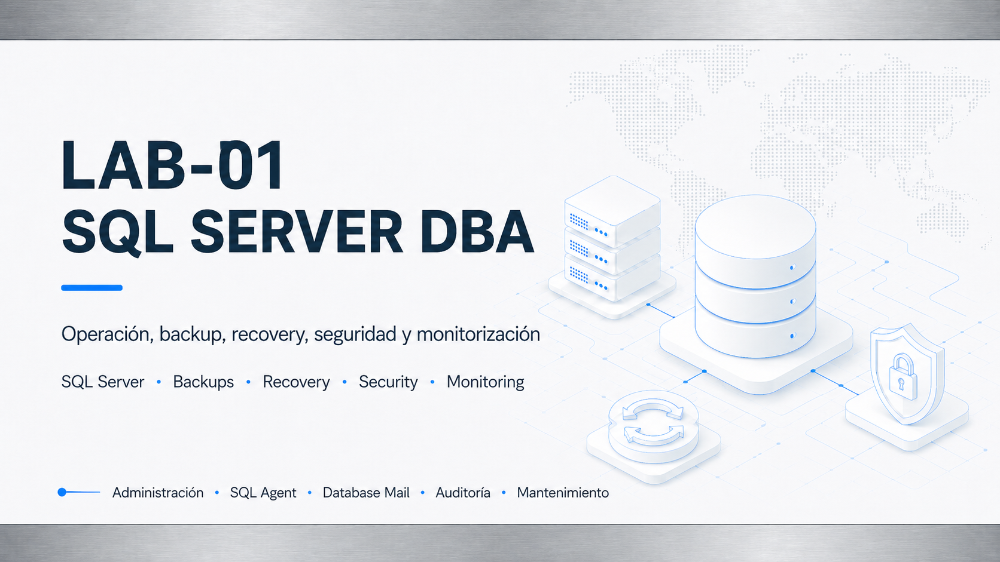
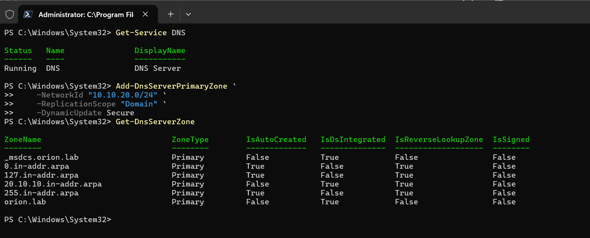
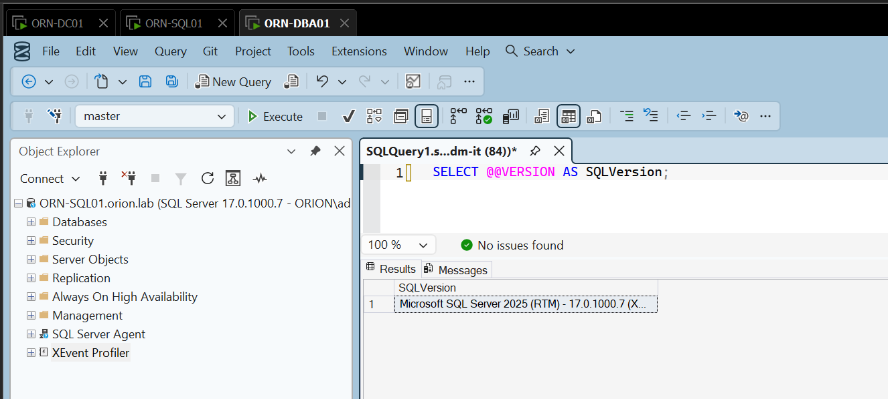
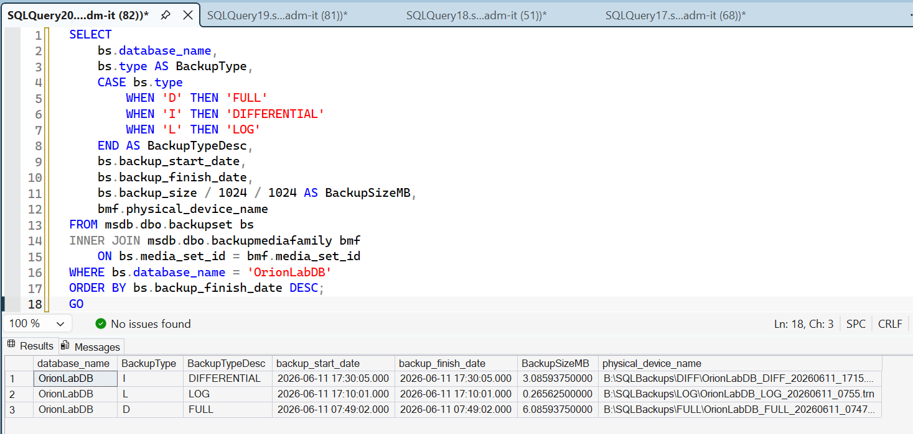
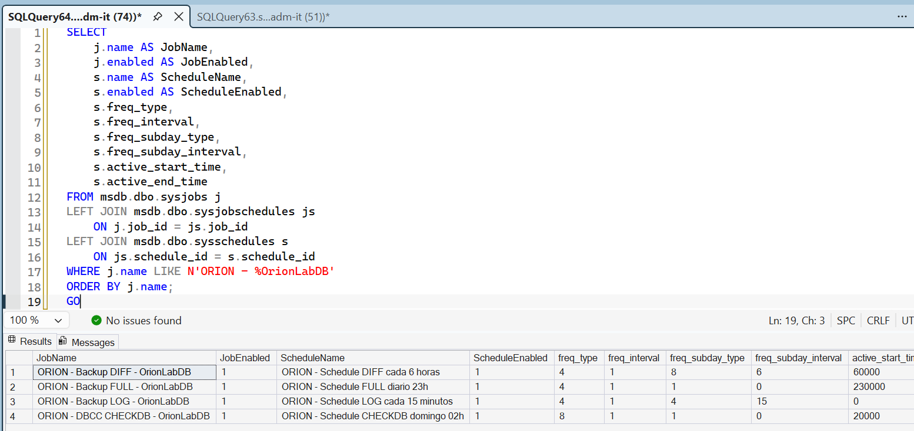
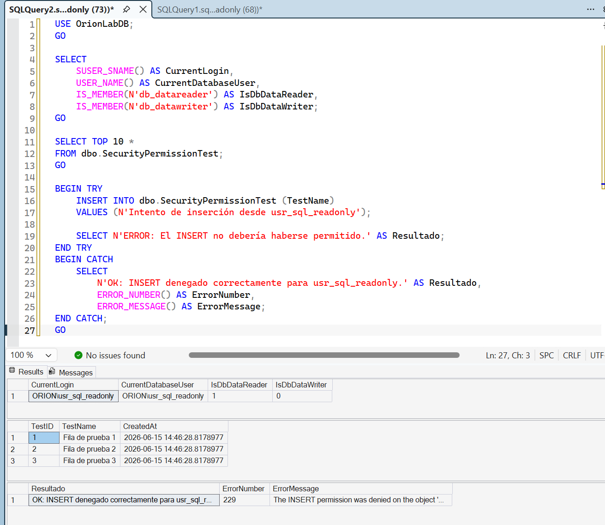
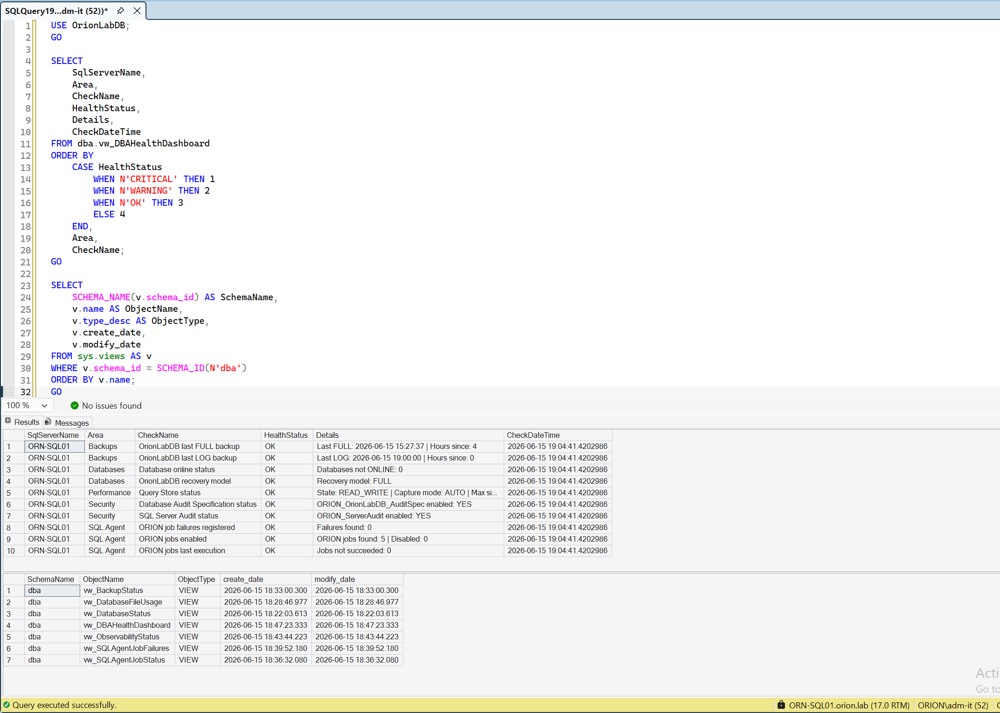

# LAB-01 — SQL Server DBA Backup, Recovery, Security, Monitoring & Maintenance

## Descripción

Laboratorio técnico orientado a administración de **SQL Server en entorno de dominio Windows**, con foco en operación DBA, continuidad de servicio, seguridad, auditoría, monitorización y documentación reproducible.

El laboratorio construye una base SQL Server formada por controlador de dominio, servidor SQL dedicado y estación administrativa DBA. Desde esa estación se realizan las validaciones, pruebas de recuperación, configuración de seguridad y tareas de operación.

---

## Objetivos

- Desplegar SQL Server 2025 Developer Edition integrado con Active Directory.
- Separar roles de infraestructura: dominio, servidor SQL y estación DBA.
- Configurar almacenamiento para datos, logs, backups, TempDB y auditoría.
- Implementar backups FULL, DIFF y LOG.
- Validar restore completo, point-in-time recovery y reparación de datos.
- Automatizar mantenimiento con SQL Server Agent.
- Configurar avisos operativos de jobs fallidos.
- Aplicar mínimo privilegio mediante grupos de Active Directory y roles SQL.
- Validar SQL Server Audit, Query Store y dashboard DBA.
- Publicar documentación y evidencias limpias para portfolio técnico.

---

## Arquitectura final

| Máquina | Rol | IP | Función |
|---|---|---:|---|
| `ORN-DC01` | Controlador de dominio / DNS | `10.10.20.10` | Dominio, grupos, usuarios y resolución interna. |
| `ORN-SQL01` | Servidor SQL Server | `10.10.20.20` | Motor SQL Server, base de datos, jobs, backups, seguridad y auditoría. |
| `ORN-DBA01` | Estación administrativa DBA | `10.10.20.30` | SSMS, PowerShell y validaciones remotas. |

---

## Bloques completados

| Bloque | Resultado |
|---|---|
| Active Directory y DNS | Dominio, OUs, grupos y cuentas de servicio. |
| SQL Server | Instalación, servicios, rutas, memoria, TCP/IP y conexión remota. |
| Base de datos | Base principal creada en recovery model FULL. |
| Backup y recovery | Backups FULL, DIFF, LOG, restore completo y PITR. |
| Reparación de datos | Datos recuperados desde base PITR y validación con DBCC CHECKDB. |
| SQL Server Agent | Jobs de backup, CHECKDB, limpieza, schedules y retención. |
| Avisos operativos | Operador DBA y notificación ante fallo de jobs. |
| Seguridad SQL | Grupos AD, roles, usuarios de prueba y mínimo privilegio. |
| Auditoría | SQL Server Audit con eventos revisados. |
| Query Store | Comparativa de consulta lenta frente a consulta optimizada. |
| Dashboard DBA | Vistas de salud para bases, ficheros, backups, jobs y estado final. |

---

## Evidencias destacadas

### Base de dominio y conexión SQL

### Backup, recovery y operación

### Seguridad, auditoría y cierre

Galería completa: [evidencias.md](evidencias.md).

---

## Documentación

| Documento | Contenido |
|---|---|
| [Arquitectura](arquitectura.md) | Máquinas, red, flujo de administración y criterios de diseño. |
| [Esquema lógico Mermaid](esquema-logico.md) | Esquema lógico renderizable en GitHub, complementario al flujo de administración publicado. |
| [Tecnologías](tecnologias.md) | Stack técnico, componentes SQL y decisiones relevantes. |
| [Plan de trabajo](plan-trabajo.md) | Fases ejecutadas del laboratorio. |
| [Checklist](checklist.md) | Validaciones finales del laboratorio. |
| [Backup & Recovery](backup-recovery.md) | Backups, restore, PITR, reparación y retención. |
| [Seguridad](seguridad.md) | Grupos AD, logins, roles y mínimo privilegio. |
| [Auditoría y monitorización](auditoria-monitorizacion.md) | Avisos, SQL Server Audit y seguimiento operativo. |
| [Dashboard DBA](dashboard-dba.md) | Vistas DBA, Query Store y salud final del entorno. |
| [Evidencias](evidencias.md) | Galería visual de capturas publicadas. |
| [Scripts](scripts/README.md) | Scripts públicos de revisión y validación. |
| [Competencias técnicas](valor-profesional.md) | Valor profesional del laboratorio. |
| [Lecciones aprendidas](lecciones-aprendidas.md) | Aprendizajes, incidencias y mejoras futuras. |

---

## Relación con LAB-02

LAB-01 actúa como base directa para el laboratorio de alta disponibilidad con SQL Server Always On Availability Groups.

La infraestructura, dominio, estación administrativa, base de datos, cuentas de servicio, backups y criterios de operación se reutilizan y evolucionan en LAB-02 para construir un entorno con WSFC, Availability Group, listener, failover y continuidad de servicio.

---

## Estado final

LAB-01 queda cerrado como **completado v1**.

El laboratorio demuestra administración SQL Server en entorno Windows realista, con recuperación, seguridad, automatización, auditoría, monitorización y documentación pública orientada a portfolio técnico.
