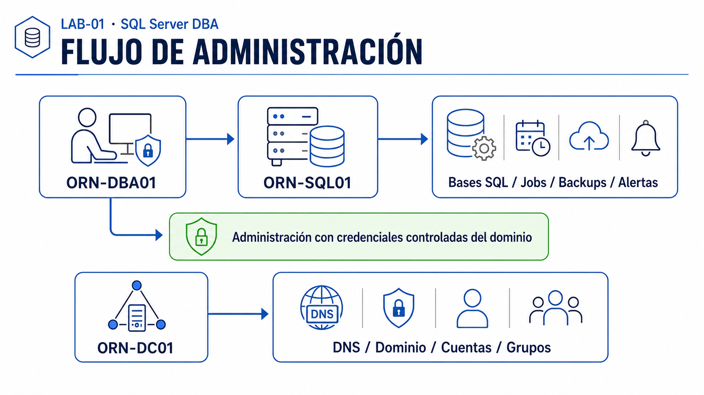
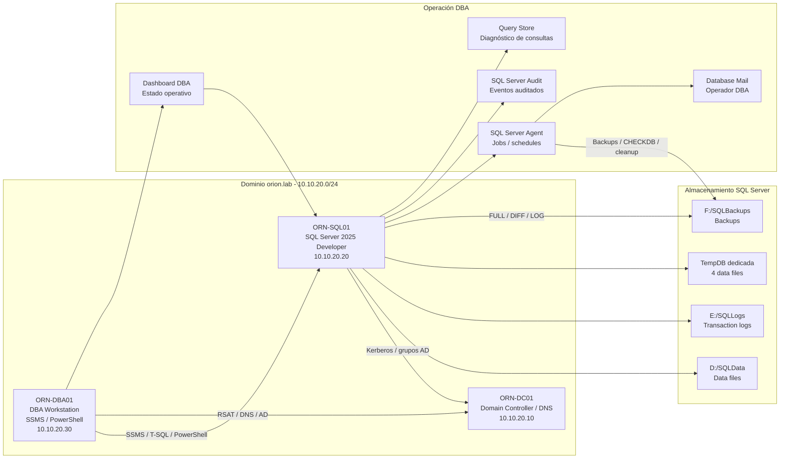

# Arquitectura — LAB-01 SQL Server DBA

## Objetivo de la arquitectura

El LAB-01 define una arquitectura de laboratorio orientada a administración profesional de SQL Server dentro de un portfolio técnico documentado.

El objetivo principal es disponer de una base técnica realista para practicar tareas de DBA junior: instalación, administración, backup, recovery, seguridad, automatización, mantenimiento, monitorización y documentación operativa.

## Diseño general

El entorno se basa en un dominio Windows llamado `orion.lab`, con separación clara entre servicios de dominio, servidor SQL y estación administrativa DBA.

| Máquina | Rol principal | IP | Función dentro del laboratorio |
|---|---|---|---|
| ORN-DC01 | Controlador de dominio y DNS | 10.10.20.10 | Servicios base del dominio `orion.lab`. |
| ORN-SQL01 | Servidor SQL Server | 10.10.20.20 | Motor SQL Server, bases de datos, jobs, backups, seguridad y mantenimiento. |
| ORN-DBA01 | Estación administrativa | 10.10.20.30 | Administración remota mediante SSMS, PowerShell y herramientas DBA. |

## Red lógica

- Red del laboratorio: `10.10.20.0/24`
- Dominio: `orion.lab`
- Administración centralizada desde estación DBA.
- Resolución interna mediante DNS del controlador de dominio.

## Flujo de administración en imagen

## Esquema lógico Mermaid

El esquema representa la relación operativa entre la estación administrativa `ORN-DBA01`, el servidor SQL `ORN-SQL01` y el controlador de dominio `ORN-DC01`.

- `ORN-DBA01` actúa como estación de administración DBA.
- `ORN-SQL01` centraliza bases SQL, jobs, backups y alertas.
- La administración se realiza con credenciales controladas del dominio.
- `ORN-DC01` proporciona servicios de DNS, dominio, cuentas y grupos.

## Componentes DBA representados

| Área | Elementos trabajados |
|---|---|
| Backup y recovery | Backups FULL, DIFF y LOG; restauración y validación. |
| Automatización | SQL Server Agent Jobs para tareas programadas. |
| Mantenimiento | CHECKDB, limpieza y validaciones periódicas. |
| Seguridad | Logins, usuarios, roles y pruebas de permisos mínimos. |
| Alertas | Database Mail, operador DBA y notificación de fallos. |
| Diagnóstico | Query Store y revisión de comportamiento de consultas. |
| Operación | Dashboard DBA para estado general del entorno. |

## Evidencias

- [01-dominio-dns-validado.png](capturas/01-dominio-dns-validado.png)
- [02-ous-grupos-ad.png](capturas/02-ous-grupos-ad.png)
- [04-ssms-conexion-remota.png](capturas/04-ssms-conexion-remota.png)
- [lab01_flujo_de_administracion.png](diagramas/lab01_flujo_de_administracion.png)

Galería completa: [evidencias.md](evidencias.md).

## Criterio de diseño

La arquitectura no busca ser un entorno empresarial completo de alta disponibilidad, sino una base limpia, entendible y defendible para portfolio.

Se priorizan los siguientes criterios:

- Claridad técnica.
- Separación de roles.
- Documentación reproducible.
- Evidencias mediante capturas y pruebas.
- Evolución futura hacia escenarios más avanzados como Always On, monitorización avanzada, hardening y automatización con PowerShell.

## Evolución prevista

El LAB-01 queda preparado como base para futuras ampliaciones del portfolio técnico:

1. Seguridad avanzada SQL Server.
2. Auditoría y cumplimiento.
3. Always On Availability Groups.
4. Monitorización centralizada.
5. Integración con laboratorios de ciberseguridad defensiva.
