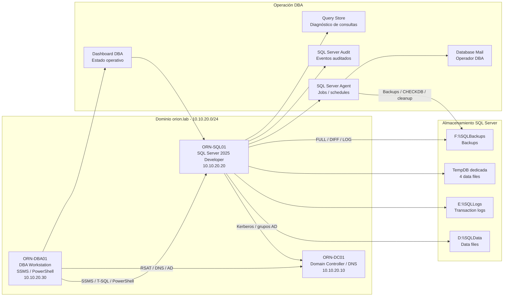

# Esquema lógico — LAB-01 SQL Server DBA

## Objetivo

Añadir un esquema lógico renderizable directamente en GitHub mediante Mermaid, manteniendo la imagen existente del flujo de administración.

La imagen publicada se conserva en:

```text
diagramas/lab01_flujo_de_administracion.png
```

## Esquema lógico Mermaid



## Lectura rápida

- ORN-DC01 aporta identidad, DNS, usuarios y grupos.
- ORN-SQL01 centraliza motor SQL, bases, backups, jobs, auditoría y mantenimiento.
- ORN-DBA01 concentra la administración remota mediante SSMS y PowerShell.
- El almacenamiento queda separado por función para representar una base DBA ordenada.
