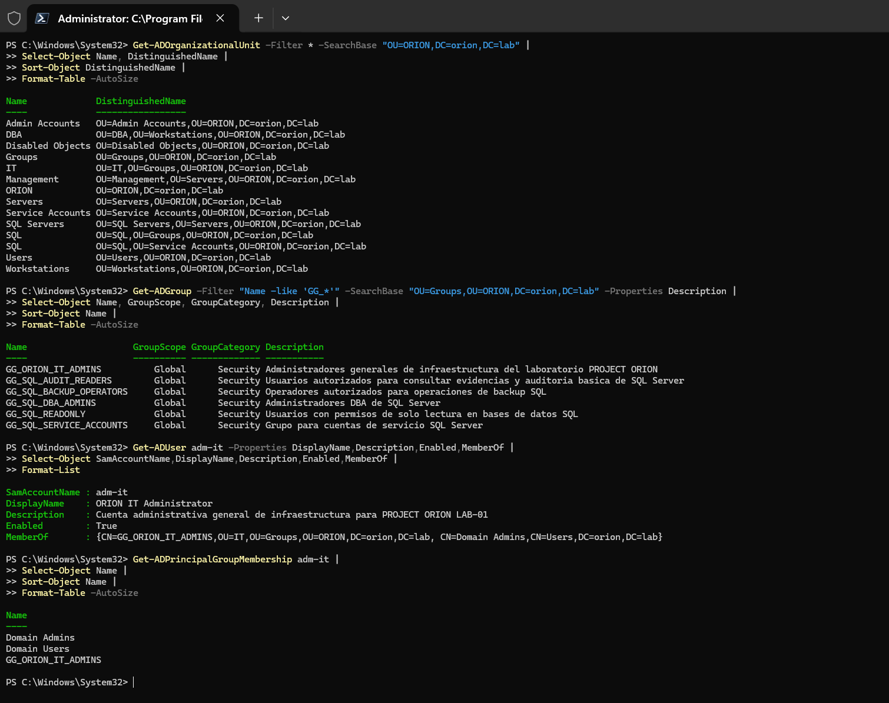
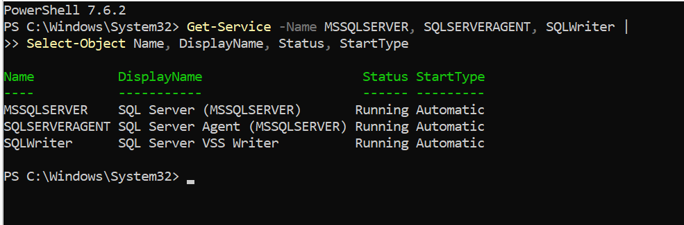
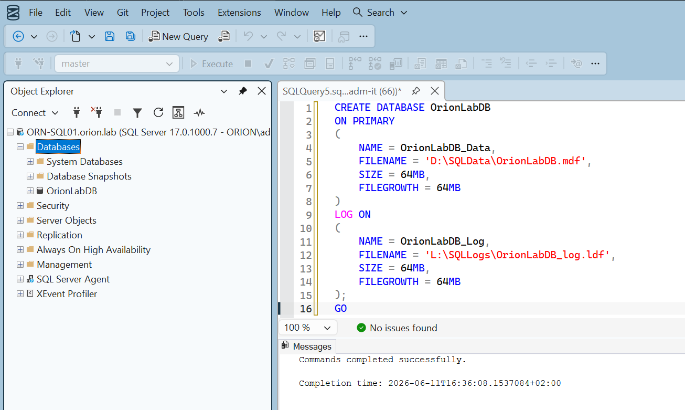
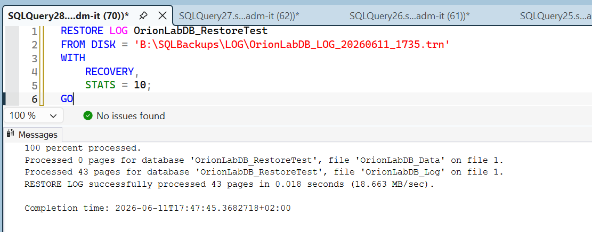
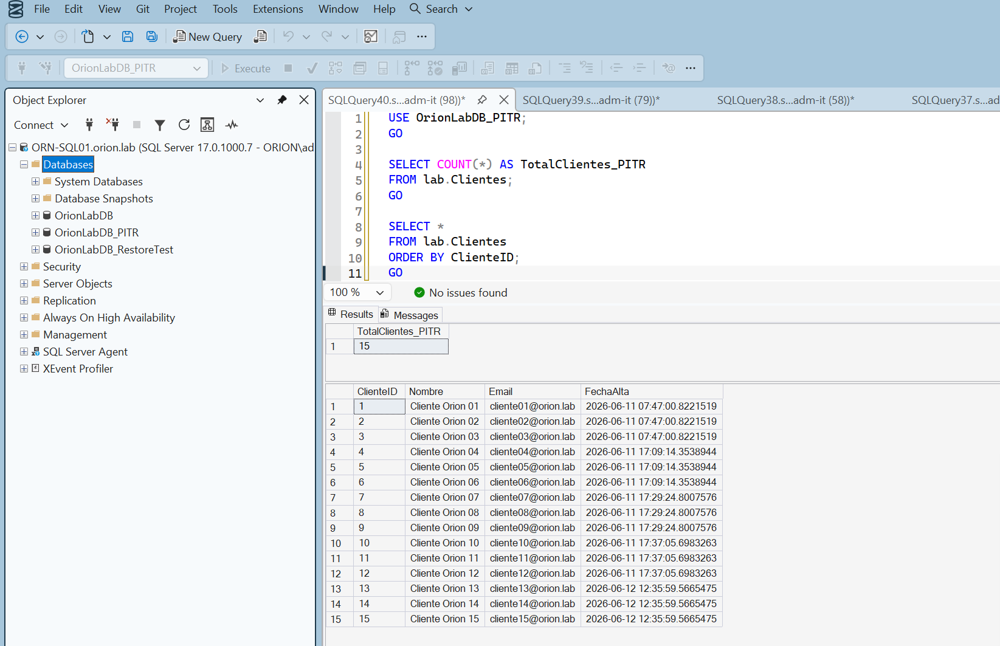
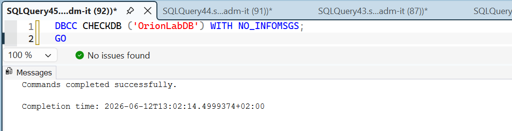
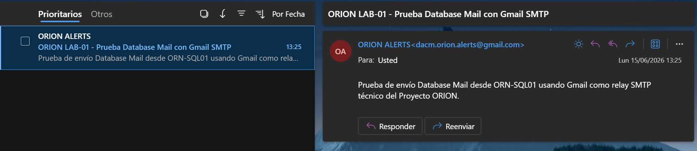
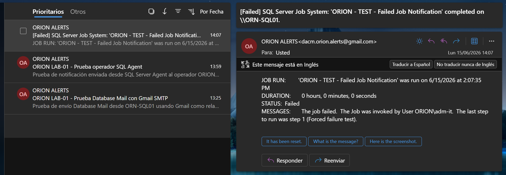
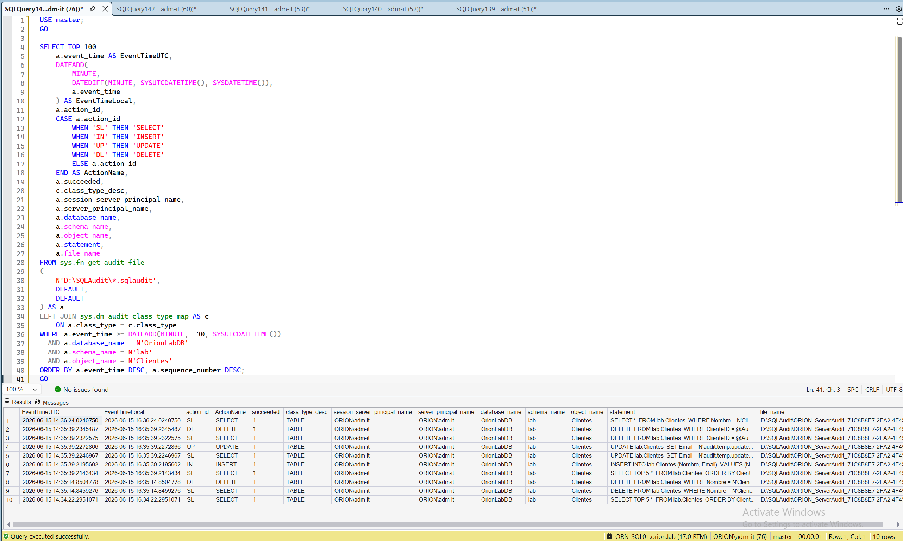
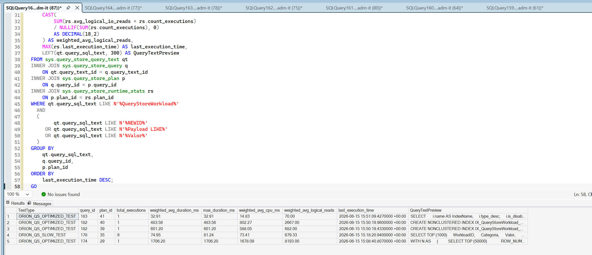

# Evidencias — LAB-01 SQL Server DBA

## Objetivo

Este documento recoge las evidencias técnicas principales del LAB-01.

Las capturas seleccionadas ya están ubicadas en la carpeta `capturas` y sirven para demostrar arquitectura, operación DBA, recuperación, automatización, seguridad, auditoría, rendimiento y estado final del laboratorio.

## Capturas principales

| Captura | Evidencia |
|---|---|
| [01-dominio-dns-validado.png](capturas/01-dominio-dns-validado.png) | Dominio, DNS y validaciones iniciales. |
| [02-ous-grupos-ad.png](capturas/02-ous-grupos-ad.png) | OUs y grupos Active Directory. |
| [03-sqlserver-instalacion-servicios.png](capturas/03-sqlserver-instalacion-servicios.png) | SQL Server instalado y servicios. |
| [04-ssms-conexion-remota.png](capturas/04-ssms-conexion-remota.png) | Conexión remota desde estación DBA. |
| [05-rutas-sql-datos-logs.png](capturas/05-rutas-sql-datos-logs.png) | Rutas SQL de datos y logs. |
| [06-backups-full-diff-log.png](capturas/06-backups-full-diff-log.png) | Backups FULL, DIFF y LOG. |
| [07-restore-completo-validado.png](capturas/07-restore-completo-validado.png) | Restore completo validado. |
| [08-pitr-validado.png](capturas/08-pitr-validado.png) | Recuperación temporal validada. |
| [09-reparacion-datos-pitr.png](capturas/09-reparacion-datos-pitr.png) | Reparación de datos desde PITR. |
| [10-sql-agent-jobs-schedules.png](capturas/10-sql-agent-jobs-schedules.png) | Jobs y schedules de SQL Server Agent. |
| [11-database-mail-sent.png](capturas/11-database-mail-sent.png) | Database Mail validado. |
| [12-operador-alertas-job-fallido.png](capturas/12-operador-alertas-job-fallido.png) | Operador DBA y alerta por fallo. |
| [13-seguridad-minimo-privilegio.png](capturas/13-seguridad-minimo-privilegio.png) | Seguridad SQL y mínimo privilegio. |
| [14-sql-server-audit-eventos.png](capturas/14-sql-server-audit-eventos.png) | Eventos SQL revisados. |
| [15-query-store-comparativa.png](capturas/15-query-store-comparativa.png) | Comparativa de consultas. |
| [16-dashboard-dba-ok.png](capturas/16-dashboard-dba-ok.png) | Dashboard DBA final. |

## Galería

### 01 — Dominio, DNS y red

### 02 — SQL Server y conexión

### 03 — Backup y recuperación

### 04 — Automatización y alertas

### 05 — Seguridad, auditoría y rendimiento

### 06 — Cierre operativo

## Criterio de publicación

- Capturas seleccionadas por valor técnico.
- No se suben imágenes repetitivas del asistente de instalación.
- El Word completo queda como memoria interna.
- GitHub muestra una versión limpia y orientada a portfolio.

## Estado

- Capturas seleccionadas: **sí**.
- Capturas subidas a GitHub: **sí**.
- Galería Markdown: **sí**.

