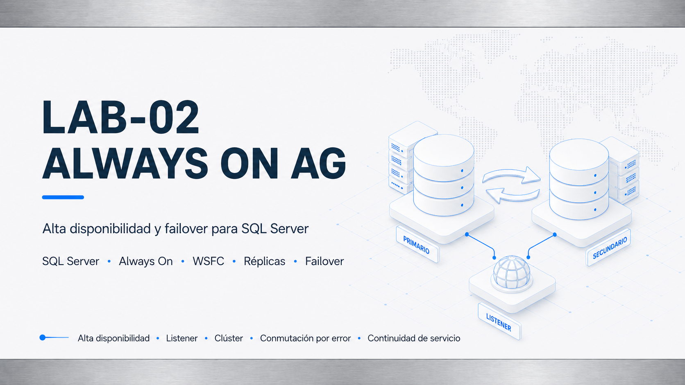

# LAB-02 — SQL Server Always On Availability Groups

## Descripción

LAB-02 amplía el entorno DBA construido en LAB-01 hacia un escenario de alta disponibilidad basado en **Windows Server Failover Cluster** y **SQL Server Always On Availability Groups**.

El laboratorio reutiliza el dominio, el primer nodo SQL, la estación administrativa y la base principal creados en LAB-01, añadiendo un segundo nodo SQL Server, un File Share Witness, un clúster WSFC, un Availability Group y un listener de conexión.

---

## Objetivos

- Construir un clúster WSFC de dos nodos para SQL Server.
- Configurar quorum mediante File Share Witness.
- Habilitar Always On en dos instancias SQL Server 2025.
- Crear el Availability Group `ORION_AG01` para proteger `OrionLabDB`.
- Configurar el listener `ORN-SQLAG01` como punto único de conexión.
- Validar failover, failback, lectura en secundaria y resincronización.
- Adaptar jobs de mantenimiento al rol real de cada réplica.
- Documentar incidencias reales, decisiones técnicas y validaciones finales.

---

## Arquitectura final

| Componente | Función | IP |
|---|---|---:|
| `ORN-DC01` | Controlador de dominio, DNS y Active Directory | `10.10.20.10` |
| `ORN-SQL01` | Nodo SQL Server / réplica primaria final | `10.10.20.20` |
| `ORN-SQL02` | Nodo SQL Server / réplica secundaria final | `10.10.20.21` |
| `ORN-DBA01` | Estación administrativa DBA / SSMS / PowerShell | `10.10.20.30` |
| `ORN-FSW01` | File Share Witness para quorum | `10.10.20.40` |
| `ORN-SQLCL01` | Windows Server Failover Cluster | `10.10.20.50` |
| `ORN-SQLAG01` | Listener del Availability Group | `10.10.20.60` |

Topología completa: [arquitectura.md](arquitectura.md).

---

## Configuración principal

| Elemento | Valor |
|---|---|
| Dominio | `orion.lab` |
| Red | `10.10.20.0/24` |
| Cluster WSFC | `ORN-SQLCL01` |
| Availability Group | `ORION_AG01` |
| Listener | `ORN-SQLAG01` |
| Listener port | `1433` |
| Endpoint HADR | `5022` |
| Quorum | File Share Witness |
| Modo de disponibilidad | `SYNCHRONOUS_COMMIT` |
| Modo de failover | `MANUAL` |
| Preferencia de backup | `SECONDARY` |
| Base protegida | `OrionLabDB` |

---

## Estado final validado

| Validación | Resultado |
|---|---|
| Cluster `ORN-SQLCL01` | Online |
| Nodos WSFC | `ORN-SQL01` Up / `ORN-SQL02` Up |
| Quorum | File Share Witness Online |
| Availability Group `ORION_AG01` | Healthy |
| `ORN-SQL01` | Primary final / Connected / Healthy |
| `ORN-SQL02` | Secondary final / Connected / Healthy |
| `OrionLabDB` | Synchronized / Healthy / Not suspended |
| Listener `ORN-SQLAG01` | Online / `10.10.20.60:1433` |
| Endpoint HADR | `5022` accesible entre nodos |
| DNS final | Limpio y coherente con la arquitectura |

---

## Pruebas realizadas

- Conexión al listener desde `ORN-DBA01`.
- Inserción inicial por listener con `ORN-SQL01` como primario.
- Failover manual de `ORN-SQL01` a `ORN-SQL02`.
- Inserción por listener tras failover.
- Failback manual a `ORN-SQL01`.
- Lectura en réplica secundaria con `ApplicationIntent=ReadOnly`.
- Resincronización de réplica tras pruebas de disponibilidad.
- Validación final de DNS y puertos `1433`, `5022` y `3343`.
- Adaptación de jobs SQL Agent a entorno Always On.

---

## Incidencias documentadas

| Incidencia | Resolución |
|---|---|
| Clonación de nodo SQL no adecuada | Se creó `ORN-SQL02` mediante instalación limpia. |
| Error de cadena LSN al unir la base al AG | Se reinicializó la secundaria con cadena `FULL + LOG` coherente y `NORECOVERY`. |
| Listener sin estado online inicial | Se precreó el objeto en Active Directory y se delegaron permisos al clúster. |
| Conexión a secundaria sin intención de lectura | Se validó conexión con `ApplicationIntent=ReadOnly`. |
| Registro DNS APIPA | Se limpió DNS y se evitó registro desde interfaz no utilizada. |
| Jobs clásicos no adaptados | Se deshabilitaron para la base protegida y se crearon jobs AG-aware. |

Detalle completo: [troubleshooting.md](troubleshooting.md).

---

## Evidencias destacadas

- Topología lógica global del entorno.
- Validación de Windows Server Failover Cluster.
- Quorum mediante File Share Witness.
- Dashboard final del clúster WSFC.
- Availability Group sincronizado y saludable.
- Listener `ORN-SQLAG01` online y validación AD/DNS.
- Lectura en réplica secundaria con `ApplicationIntent=ReadOnly`.
- Failover, escritura por listener y failback.
- DNS y puertos finales validados.
- Jobs AG-aware en ambos nodos.
- Preferencia de backup en secundaria y backup de log generado desde `ORN-SQL02`.

Relación de capturas: [evidencias.md](evidencias.md).

---

## Documentación

| Documento | Contenido |
|---|---|
| [Arquitectura](arquitectura.md) | Diseño final de nodos, red, quorum, listener y flujo HA. |
| [Tecnologías](tecnologias.md) | Stack técnico utilizado. |
| [Plan de trabajo](plan-trabajo.md) | Fases ejecutadas del laboratorio. |
| [Checklist](checklist.md) | Estado de validaciones y cierre. |
| [Validaciones](validaciones.md) | Pruebas técnicas realizadas y resultado. |
| [Troubleshooting](troubleshooting.md) | Incidencias encontradas y resolución. |
| [Evidencias](evidencias.md) | Relación de capturas publicadas y evidencias operativas. |
| [Scripts](scripts/README.md) | Scripts públicos de validación final. |
| [Competencias técnicas](valor-profesional.md) | Valor profesional del laboratorio. |
| [Lecciones aprendidas](lecciones-aprendidas.md) | Conclusiones técnicas y aprendizajes. |

---

## Relación con LAB-01

LAB-02 no reconstruye el entorno desde cero. Extiende el trabajo realizado en LAB-01, donde ya existían dominio, servidor SQL principal, estación DBA, base de datos, jobs, backups, seguridad y monitorización básica.

Este laboratorio añade la capa de alta disponibilidad y demuestra continuidad de servicio mediante clúster, réplicas, listener, failover, resincronización y jobs adaptados al rol de cada nodo.

---

## Estado final

LAB-02 queda cerrado como **completado v1**.

El laboratorio demuestra alta disponibilidad SQL Server con WSFC, Availability Groups, listener, failover manual, validaciones operativas y documentación pública orientada a portfolio técnico.
