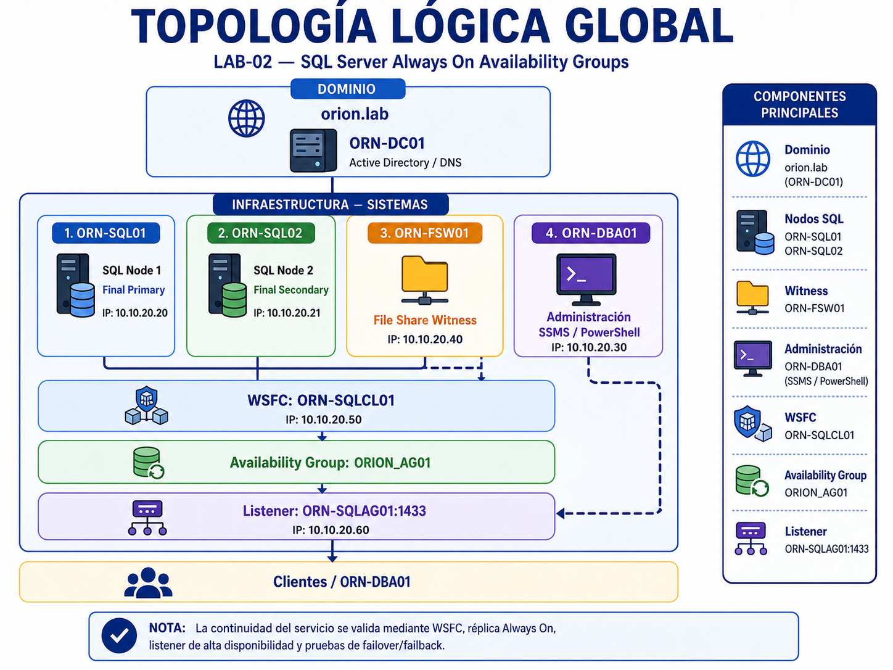
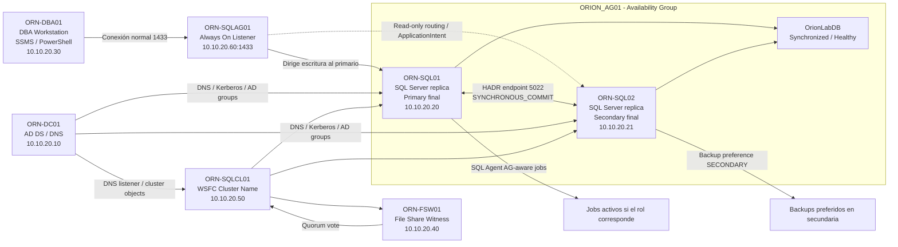

# Arquitectura — LAB-02 SQL Server Always On

## Objetivo

Documentar la arquitectura final de alta disponibilidad para SQL Server basada en **Windows Server Failover Cluster** y **SQL Server Always On Availability Groups**.

## Topología lógica en imagen

La siguiente imagen muestra la topología lógica final del LAB-02, incluyendo dominio, nodos SQL, File Share Witness, clúster WSFC, Availability Group, listener de alta disponibilidad y estación administrativa.

## Esquema lógico Mermaid

## Máquinas finales

| Máquina | Función | IP | Observaciones |
|---|---|---|---|
| `ORN-DC01` | Controlador de dominio y DNS | `10.10.20.10` | Reutilizado desde LAB-01. |
| `ORN-SQL01` | Nodo SQL Server 1 | `10.10.20.20` | Réplica primaria final. |
| `ORN-SQL02` | Nodo SQL Server 2 | `10.10.20.21` | Réplica secundaria final. |
| `ORN-DBA01` | Estación administrativa | `10.10.20.30` | SSMS y PowerShell. |
| `ORN-FSW01` | File Share Witness | `10.10.20.40` | Quorum del clúster. |
| `ORN-SQLCL01` | Nombre del clúster WSFC | `10.10.20.50` | Recurso de clúster. |
| `ORN-SQLAG01` | Listener Always On | `10.10.20.60` | Punto único de conexión SQL. |

## Recursos de laboratorio

| Máquina | RAM | vCPU | Rol |
|---|---:|---:|---|
| `ORN-DC01` | 2 GB | 2 | AD DS / DNS |
| `ORN-SQL01` | 4 GB | 4 | SQL Server / AG replica |
| `ORN-SQL02` | 4 GB | 4 | SQL Server / AG replica |
| `ORN-DBA01` | 4 GB | 2 | Administración |
| `ORN-FSW01` | 2 GB | 1 | File Share Witness |

Consumo aproximado total: **16 GB RAM**.

## Componentes principales

| Componente | Configuración |
|---|---|
| Dominio | `orion.lab` |
| Red interna | `10.10.20.0/24` |
| Cluster | `ORN-SQLCL01` |
| Availability Group | `ORION_AG01` |
| Listener | `ORN-SQLAG01` |
| Listener IP | `10.10.20.60` |
| Listener port | `1433` |
| Endpoint HADR | `5022` |
| Quorum | File Share Witness |
| Witness share | `\\ORN-FSW01\ORION-SQLCL01-Witness` |
| Base protegida | `OrionLabDB` |

## Diseño de alta disponibilidad

- Dos nodos SQL Server dentro del mismo dominio.
- WSFC sin almacenamiento compartido.
- Quorum mediante File Share Witness.
- Availability Group en modo `SYNCHRONOUS_COMMIT`.
- Failover configurado como `MANUAL`.
- Listener dedicado para abstraer el nodo primario activo.
- Réplica secundaria configurada para conexiones `READ_ONLY`.
- Preferencia de backup configurada en `SECONDARY`.

## Flujo de conexión

Las herramientas administrativas o aplicaciones se conectan al listener `ORN-SQLAG01` por el puerto `1433`. El listener dirige la conexión hacia la réplica primaria activa:

- Estado final normal: `ORN-SQLAG01` dirige a `ORN-SQL01`.
- Tras failover manual: `ORN-SQLAG01` dirige a `ORN-SQL02`.
- Tras failback: `ORN-SQLAG01` vuelve a dirigir a `ORN-SQL01`.

## Criterios de diseño aplicados

- Reutilizar la base validada en LAB-01.
- Mantener roles separados por máquina.
- Validar el clúster antes de crear Always On.
- Documentar incidencias reales y correcciones.
- Mantener DNS limpio y coherente con la arquitectura.
- Adaptar jobs SQL Agent al rol de cada réplica.
