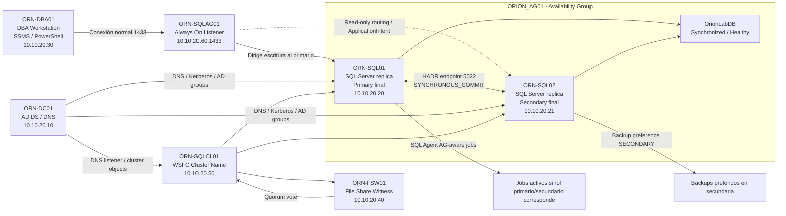

# Esquema lógico — LAB-02 SQL Server Always On HADR

## Objetivo

Añadir un esquema lógico renderizable directamente en GitHub mediante Mermaid, manteniendo la topología visual existente.

La imagen publicada se conserva en:

```text
diagramas/01-topologia-logica-global-lab02.png
```

## Esquema lógico Mermaid



## Lectura rápida

- El listener `ORN-SQLAG01` abstrae el nodo primario activo.
- `ORN-SQL01` queda como réplica primaria final y `ORN-SQL02` como secundaria final.
- WSFC y File Share Witness sostienen el clúster y quorum.
- Los jobs se adaptan al rol de la réplica para evitar tareas incorrectas tras failover.
