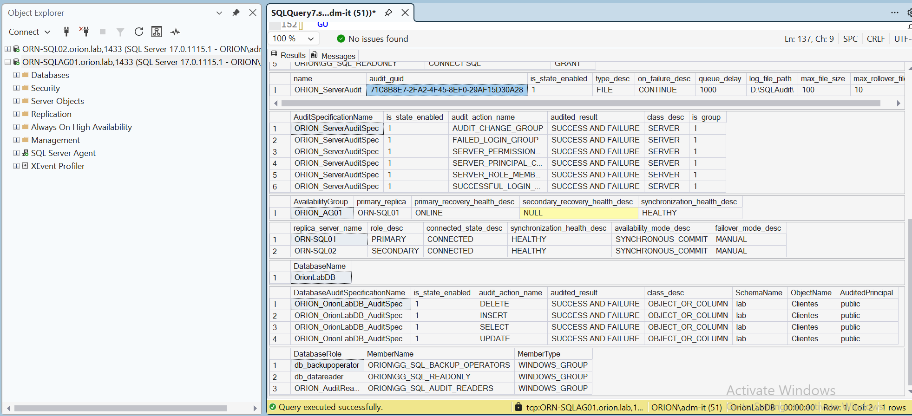
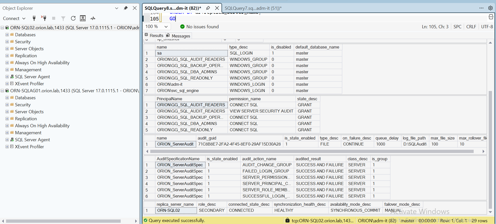
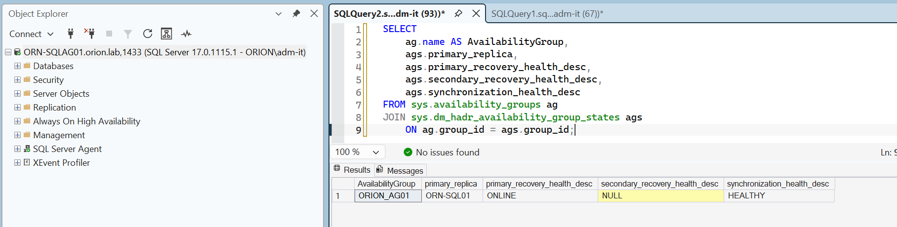
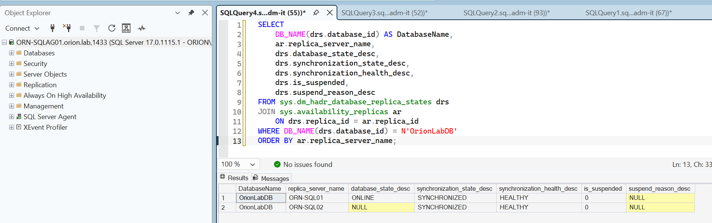
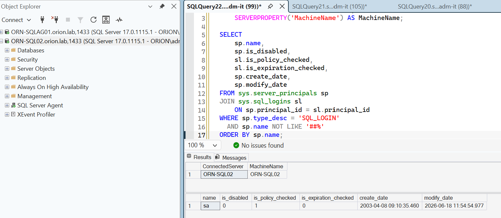
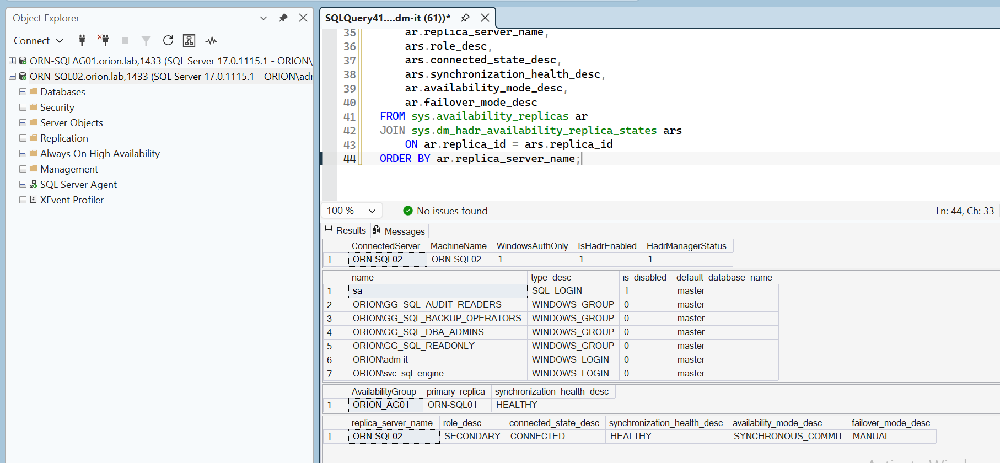
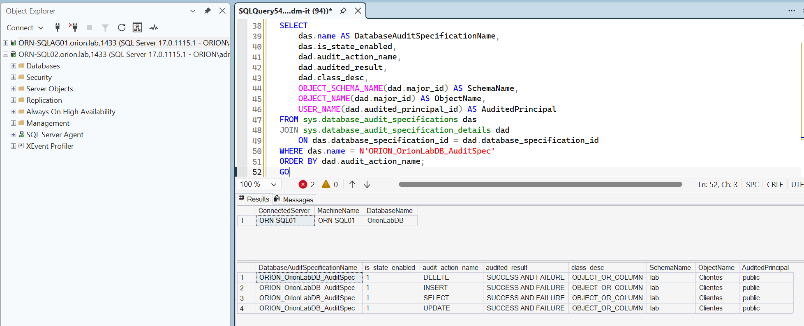
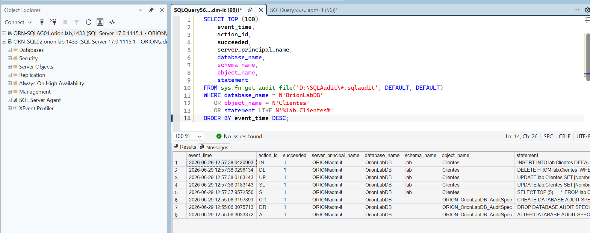
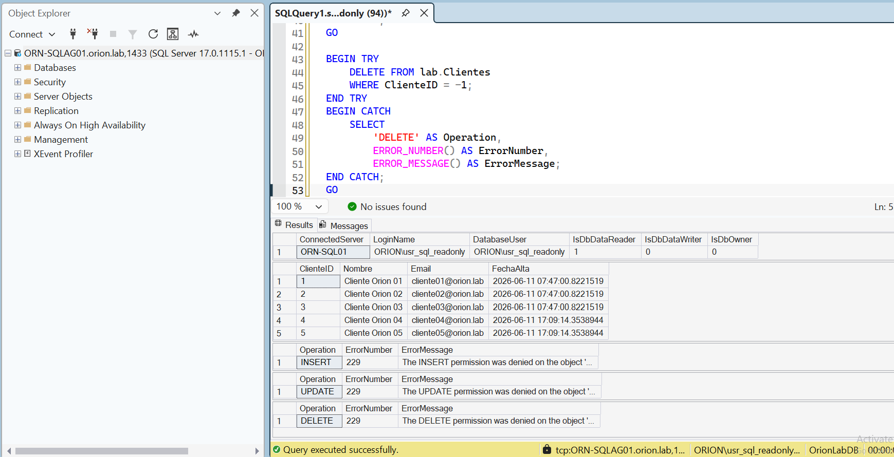

# LAB-03 — SQL Server Hardening, Audit & Compliance

## Descripción

LAB-03 endurece el entorno de alta disponibilidad construido en LAB-02, incorporando controles de seguridad, auditoría y validaciones de cumplimiento sobre un despliegue SQL Server Always On Availability Groups.

El laboratorio parte de una arquitectura HADR ya funcional y añade una capa defensiva orientada a operación real: reducción de superficie de ataque, autenticación Windows-only, deshabilitación de `sa`, alineación de logins y grupos de Active Directory, auditoría de servidor, auditoría de base de datos, trazabilidad de operaciones sobre tablas y pruebas reales de mínimo privilegio.

---

## Objetivos

- Validar el estado inicial del entorno Always On antes de aplicar cambios.
- Inventariar logins, roles, permisos, endpoints, linked servers, credenciales, proxies y auditorías.
- Corregir asimetrías de hardening entre `ORN-SQL01` y `ORN-SQL02`.
- Homogeneizar ambos nodos en modo Windows Authentication only.
- Mantener `sa` deshabilitado en ambos nodos.
- Reducir superficie de ataque SQL Server.
- Activar y alinear auditoría de servidor en ambos nodos.
- Alinear el `audit_guid` entre réplicas para compatibilidad con Always On.
- Auditar operaciones `SELECT`, `INSERT`, `UPDATE` y `DELETE` sobre `OrionLabDB.lab.Clientes`.
- Validar mínimo privilegio con usuarios reales de dominio.
- Generar un checklist final de cumplimiento en SQL01 y SQL02.

---

## Arquitectura validada

| Componente | Función | IP |
|---|---|---:|
| `ORN-DC01` | Controlador de dominio, DNS y Active Directory | `10.10.20.10` |
| `ORN-SQL01` | SQL Server / réplica primaria final | `10.10.20.20` |
| `ORN-SQL02` | SQL Server / réplica secundaria final | `10.10.20.21` |
| `ORN-DBA01` | Estación administrativa DBA / SSMS / PowerShell | `10.10.20.30` |
| `ORN-FSW01` | File Share Witness para quorum | `10.10.20.40` |
| `ORN-SQLCL01` | Windows Server Failover Cluster | `10.10.20.50` |
| `ORN-SQLAG01` | Listener del Availability Group | `10.10.20.60` |

Detalle completo: [arquitectura.md](arquitectura.md).

---

## Configuración principal

| Elemento | Valor final |
|---|---|
| Dominio | `orion.lab` |
| Availability Group | `ORION_AG01` |
| Listener | `ORN-SQLAG01.orion.lab:1433` |
| Base protegida | `OrionLabDB` |
| Tabla auditada | `lab.Clientes` |
| Modo de autenticación | Windows Authentication only |
| Login `sa` | Deshabilitado en ambos nodos |
| Auditoría de servidor | `ORION_ServerAudit` |
| Audit specification | `ORION_ServerAuditSpec` |
| Database audit specification | `ORION_OrionLabDB_AuditSpec` |
| Ruta auditoría | `D:\SQLAudit\` |
| `audit_guid` alineado | `71C8B8E7-2FA2-4F45-8EF0-29AF15D30A28` |
| Modo AG | `SYNCHRONOUS_COMMIT` |
| Failover | Manual |

---

## Estado final validado

| Validación | Resultado |
|---|---|
| `ORN-SQL01` | Primary / Connected / Healthy |
| `ORN-SQL02` | Secondary / Connected / Healthy |
| `ORION_AG01` | Healthy |
| `OrionLabDB` | Synchronized / Healthy / Not suspended |
| `ORN-SQLAG01` | Listener operativo |
| Autenticación | Windows-only en ambos nodos |
| `sa` | Deshabilitado en SQL01 y SQL02 |
| Opciones peligrosas | Deshabilitadas |
| Auditoría de servidor | Activa en SQL01 y SQL02 |
| Auditoría de base | Activa sobre `lab.Clientes` |
| Mínimo privilegio | Validado con usuarios reales |

---

## Controles aplicados

| Control | Estado | Evidencia |
|---|---|---|
| Reducción de superficie | Aplicado | `xp_cmdshell`, `Ole Automation`, `Ad Hoc Distributed Queries`, `clr enabled`, `cross db ownership chaining`, `remote admin connections` y `contained database authentication` a `0`. |
| Windows-only | Aplicado | `SERVERPROPERTY('IsIntegratedSecurityOnly') = 1` en ambos nodos. |
| Deshabilitación de `sa` | Aplicado | `sa` aparece con `is_disabled = 1`. |
| Grupos AD funcionales | Aplicado | `GG_SQL_READONLY`, `GG_SQL_BACKUP_OPERATORS`, `GG_SQL_AUDIT_READERS`, `GG_SQL_DBA_ADMINS`. |
| Auditoría servidor | Aplicado | `ORION_ServerAudit` activo en ambos nodos. |
| Audit GUID alineado | Aplicado | Mismo GUID en SQL01 y SQL02. |
| Auditoría base | Aplicado | `SELECT`, `INSERT`, `UPDATE`, `DELETE` sobre `lab.Clientes`. |
| Mínimo privilegio | Validado | Usuarios readonly, audit y backup operator probados con SSMS. |

---

## Pruebas realizadas

- Preflight DNS, puertos, listener, Always On y jobs AG-aware.
- Baseline de seguridad de SQL01 y SQL02.
- Inventario de logins, roles, permisos, endpoints, linked servers, credenciales, proxies y auditorías.
- Hardening correctivo en SQL02 y SQL01.
- Reinicio controlado de SQL02 para aplicar Windows-only.
- Validación global post-hardening.
- Configuración de auditoría de servidor en SQL02.
- Alineación de `audit_guid` entre SQL01 y SQL02.
- Creación de auditoría específica sobre `OrionLabDB.lab.Clientes`.
- Generación y lectura de eventos `.sqlaudit`.
- Validación de auditoría en réplica secundaria read-only.
- Pruebas reales de permisos con `usr_sql_readonly`, `usr_sql_audit` y `usr_sql_backupop`.
- Snapshot final de cumplimiento en ambos nodos.

---

## Evidencias visuales clave

### Preflight y estado HADR

### Baseline y hardening

### Auditoría y mínimo privilegio

Galería completa: [evidencias.md](evidencias.md).

---

## Documentación

| Documento | Contenido |
|---|---|
| [Arquitectura](arquitectura.md) | Diseño del entorno, flujo Always On y separación de funciones. |
| [Tecnologías](tecnologias.md) | Stack técnico utilizado. |
| [Plan de trabajo](plan-trabajo.md) | Bloques ejecutados y secuencia del laboratorio. |
| [Hardening](hardening.md) | Baseline, hallazgos y correcciones aplicadas. |
| [Auditoría](auditoria.md) | Auditoría de servidor, base de datos, audit GUID y eventos. |
| [Mínimo privilegio](minimo-privilegio.md) | Pruebas reales con usuarios readonly, auditor y backup operator. |
| [Validaciones](validaciones.md) | Pruebas técnicas y resultados finales. |
| [Checklist](checklist.md) | Checklist de cumplimiento final. |
| [Evidencias](evidencias.md) | Capturas y evidencias seleccionadas. |
| [Troubleshooting](troubleshooting.md) | Incidencias reales y resolución. |
| [Scripts](scripts/README.md) | Scripts SQL y PowerShell utilizados. |
| [Competencias técnicas](valor-profesional.md) | Valor profesional demostrado. |
| [Lecciones aprendidas](lecciones-aprendidas.md) | Aprendizajes técnicos del LAB-03. |

---

## Relación con LAB-02

LAB-03 no reconstruye la plataforma. Parte directamente del entorno Always On construido en LAB-02 y lo transforma en un escenario más seguro, auditable y orientado a cumplimiento.

LAB-02 demuestra alta disponibilidad y continuidad de servicio. LAB-03 demuestra que esa plataforma también puede endurecerse, auditarse y validarse con separación de responsabilidades.

---

## Estado final

LAB-03 queda cerrado como **completado v1**.

El laboratorio demuestra hardening SQL Server, auditoría, trazabilidad, mínimo privilegio, validación de cumplimiento y operación segura sobre un entorno Always On de dos nodos.
