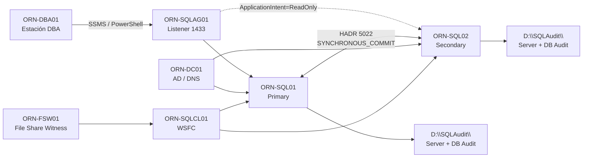

# Arquitectura — LAB-03 SQL Server Hardening, Audit & Compliance

## Objetivo

Este documento describe la arquitectura utilizada para endurecer, auditar y validar el entorno SQL Server Always On construido en LAB-02.

LAB-03 mantiene la misma base HADR y añade controles de seguridad, auditoría y cumplimiento sobre ambos nodos SQL Server.

---

## Componentes

| Componente | Rol técnico | Descripción |
|---|---|---|
| `ORN-DC01` | Domain Controller / DNS | Controlador de dominio `orion.lab`, resolución DNS y grupos de Active Directory. |
| `ORN-SQL01` | SQL Server primary | Réplica primaria final del Availability Group. Nodo principal de escritura. |
| `ORN-SQL02` | SQL Server secondary | Réplica secundaria final. Nodo validado para lectura y auditoría. |
| `ORN-DBA01` | Estación DBA | Administración con SSMS, PowerShell y pruebas con usuarios reales. |
| `ORN-FSW01` | File Share Witness | Testigo de quorum para WSFC. |
| `ORN-SQLCL01` | WSFC | Clúster Windows Server Failover Cluster. |
| `ORN-SQLAG01` | Listener | Punto único de conexión para aplicaciones y administración. |

---

## Red y servicios

| Servicio | Puerto | Uso |
|---|---:|---|
| SQL Server | `1433` | Conexión a instancias SQL y listener. |
| HADR endpoint | `5022` | Sincronización Always On entre réplicas. |
| WSFC cluster | `3343` | Comunicación de clúster. |
| DNS | `53` | Resolución de nombres del dominio `orion.lab`. |

---

## Flujo lógico

---

## Diseño de seguridad

La seguridad se basa en Active Directory y separación de responsabilidades:

| Grupo AD | Función |
|---|---|
| `ORION\GG_SQL_DBA_ADMINS` | Administración SQL Server. |
| `ORION\GG_SQL_READONLY` | Lectura de datos controlada. |
| `ORION\GG_SQL_BACKUP_OPERATORS` | Ejecución de backups sin lectura de datos. |
| `ORION\GG_SQL_AUDIT_READERS` | Consulta de auditoría sin acceso a datos de negocio. |

Usuarios funcionales probados:

| Usuario | Uso validado |
|---|---|
| `ORION\usr_sql_readonly` | Lectura permitida, escritura denegada. |
| `ORION\usr_sql_audit` | Lectura de auditoría permitida, datos de negocio denegados. |
| `ORION\usr_sql_backupop` | Backup permitido, lectura de datos denegada. |

---

## Auditoría

La auditoría queda configurada en ambos nodos:

| Elemento | Valor |
|---|---|
| Server Audit | `ORION_ServerAudit` |
| Server Audit Specification | `ORION_ServerAuditSpec` |
| Database Audit Specification | `ORION_OrionLabDB_AuditSpec` |
| Ruta | `D:\SQLAudit\` |
| Audit GUID | `71C8B8E7-2FA2-4F45-8EF0-29AF15D30A28` |
| Tabla auditada | `OrionLabDB.lab.Clientes` |

El `audit_guid` se alineó entre `ORN-SQL01` y `ORN-SQL02` para mantener coherencia de auditoría en escenario Always On y evitar problemas tras un posible failover.

---

## Estado final

| Elemento | Estado |
|---|---|
| `ORN-SQL01` | Primary / Connected / Healthy |
| `ORN-SQL02` | Secondary / Connected / Healthy |
| `ORION_AG01` | Healthy |
| `OrionLabDB` | Synchronized / Healthy |
| Autenticación | Windows-only en ambos nodos |
| `sa` | Deshabilitado en ambos nodos |
| Auditoría | Activa en ambos nodos |
| Mínimo privilegio | Validado con usuarios reales |

---

## Nota de publicación

Los nombres `ORION`, `ORN-*` y `orion.lab` forman parte de la nomenclatura interna del laboratorio para ordenar máquinas, dominio, recursos y evidencias. No representan una infraestructura real de producción.