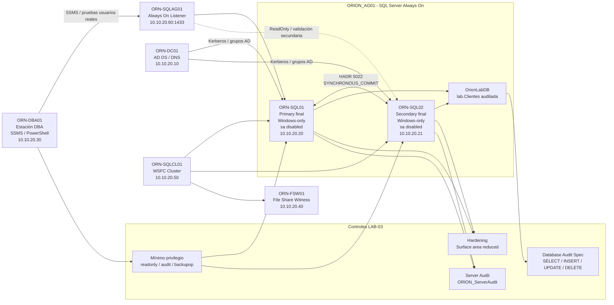

# Esquema lógico — LAB-03 SQL Server Hardening, Audit & Compliance

## Objetivo

Añadir un esquema lógico renderizable directamente en GitHub mediante Mermaid, manteniendo la portada, la topología visual y las evidencias existentes.

La imagen publicada se conserva en:

```text
diagramas/Lab003-Topologia_logica_global.png
```

## Esquema lógico Mermaid



## Lectura rápida

- LAB-03 no reconstruye la plataforma: endurece el Always On creado en LAB-02.
- La autenticación queda en Windows-only y `sa` deshabilitado.
- La auditoría se aplica a nivel servidor y base de datos.
- El mínimo privilegio se valida con usuarios reales de dominio.
