# Evidencias — LAB-03 SQL Server Hardening, Audit & Compliance
## Objetivo
Este documento recoge una selección de capturas representativas del LAB-03. Las evidencias se han extraído de la memoria completa del laboratorio y se publican organizadas por bloque técnico, evitando capturas con credenciales, secretos o datos sensibles.
---
## Criterio de publicación
- No publicar contraseñas ni secretos.
- No publicar correos personales ni credenciales de Database Mail sin censura.
- Priorizar capturas que demuestran estado final, validaciones reales y controles aplicados.
- Mantener una selección representativa para que GitHub sea navegable y no una copia completa de la memoria.
---
## 01 — Preflight y baseline operativo
### Validación DNS del dominio y recursos críticos.
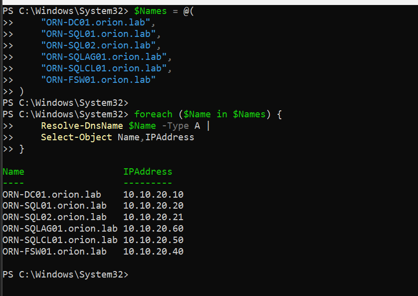
### Validación de puertos SQL Server, HADR y WSFC.
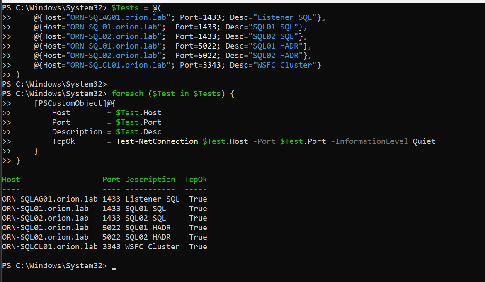
### Conexión al listener y propiedades principales.
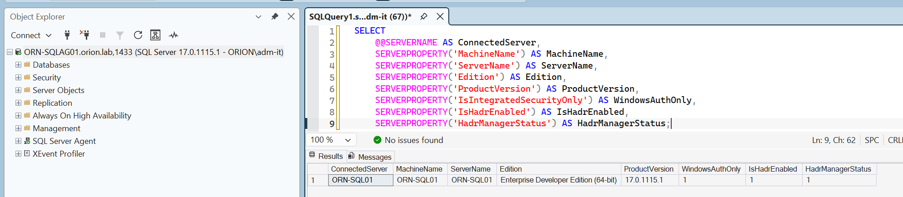
### Estado general del Availability Group.

### Base OrionLabDB sincronizada dentro del AG.

### Jobs AG-aware en SQL01.
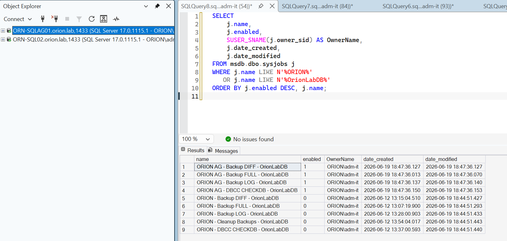
### Jobs AG-aware en SQL02.
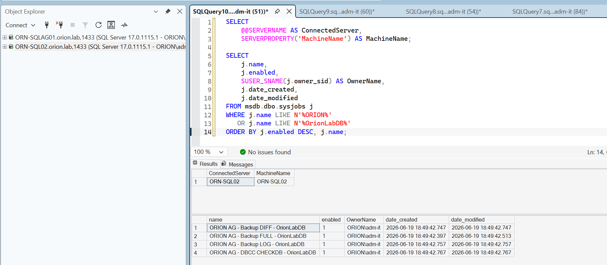
---
## 02 — Baseline de seguridad
### Hallazgo inicial: sa habilitado en SQL02.

### Inventario de logins en SQL01.
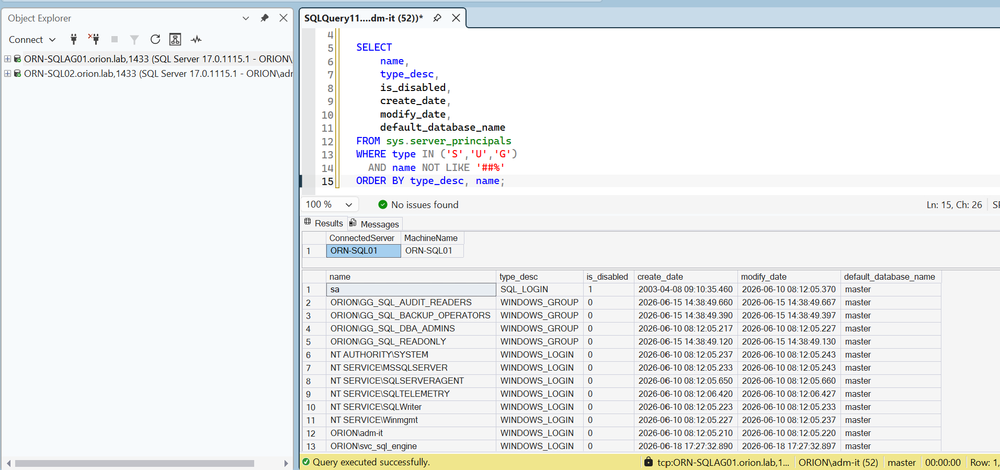
### Inventario de logins en SQL02.
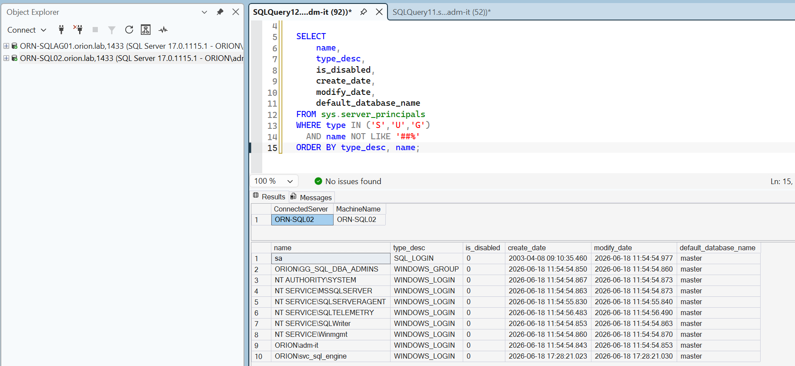
---
## 03 — Hardening y superficie de ataque
### sa deshabilitado en SQL02.
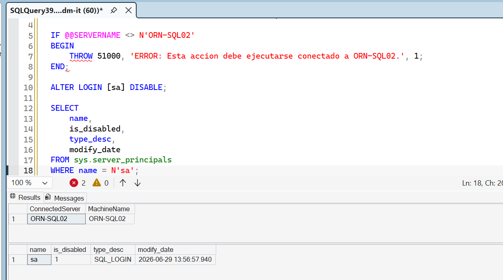
### Validación post-hardening en SQL02.

### Superficie de ataque reducida en SQL01.
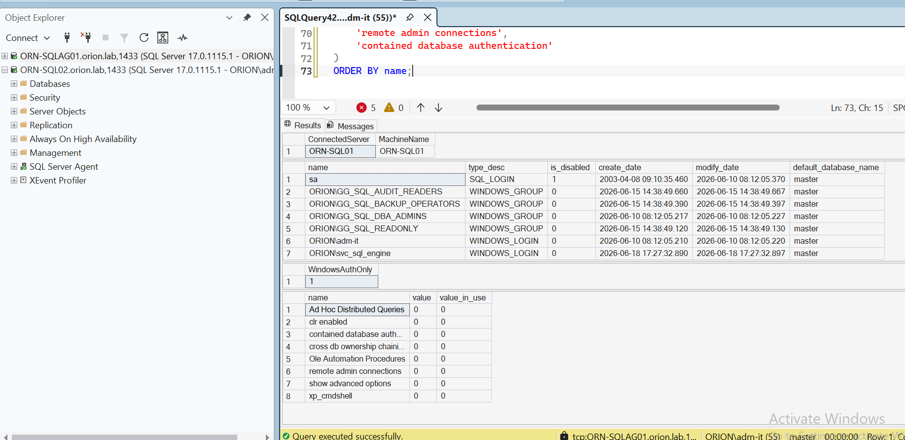
---
## 04 — Mínimo privilegio y roles
### Validación de mínimo privilegio: usuario readonly.

### Validación de mínimo privilegio: usuario auditor.
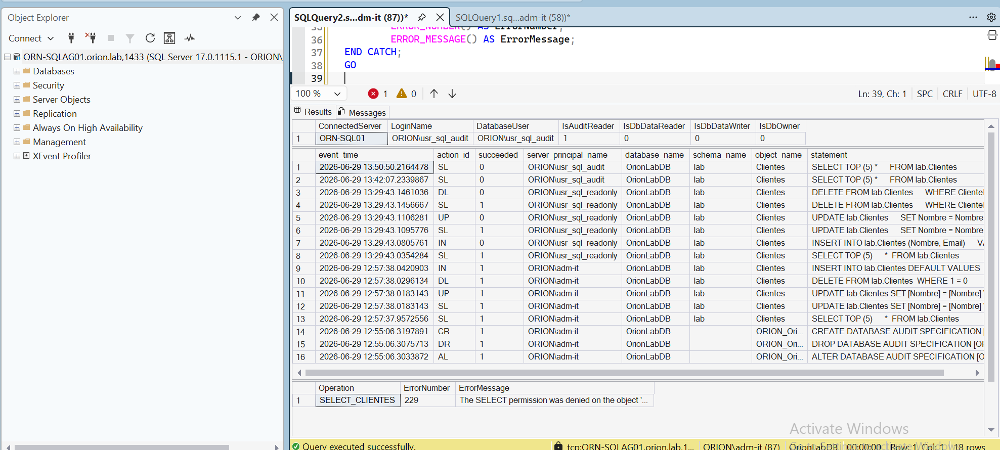
### Validación de mínimo privilegio: backup operator.
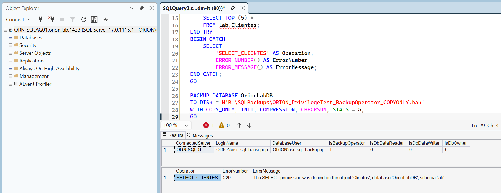
### Fichero de backup generado por backup operator.
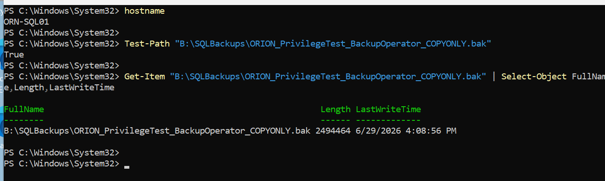
---
## 05 — Auditoría y trazabilidad
### Auditoría de servidor activa en SQL01.
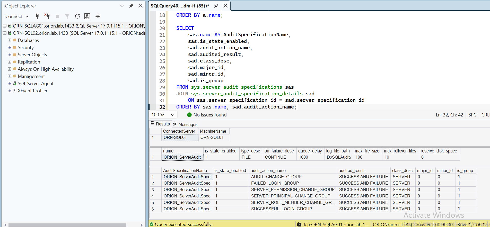
### Auditoría de servidor activa en SQL02.
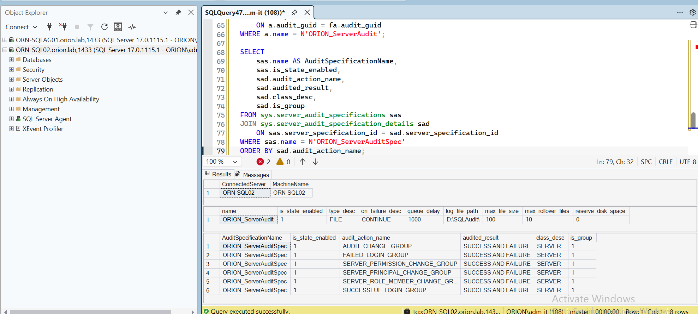
### Audit GUID alineado entre réplicas.
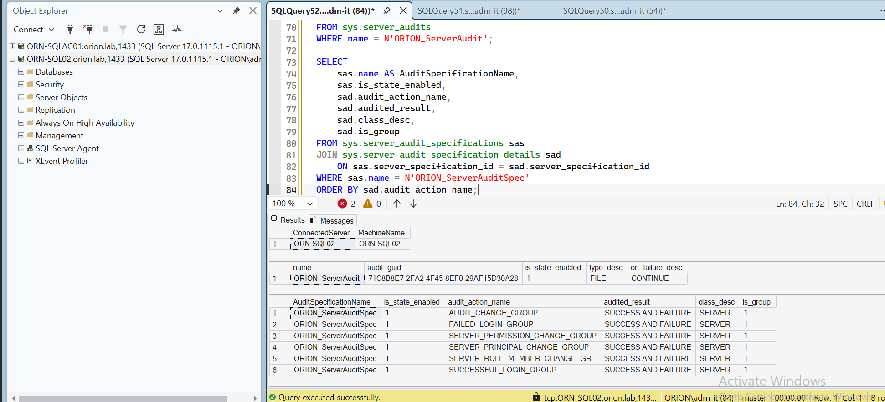
### Database Audit Specification sobre lab.Clientes.

### Eventos auditados sobre lab.Clientes en SQL01.

### Eventos auditados sobre lab.Clientes en SQL02.
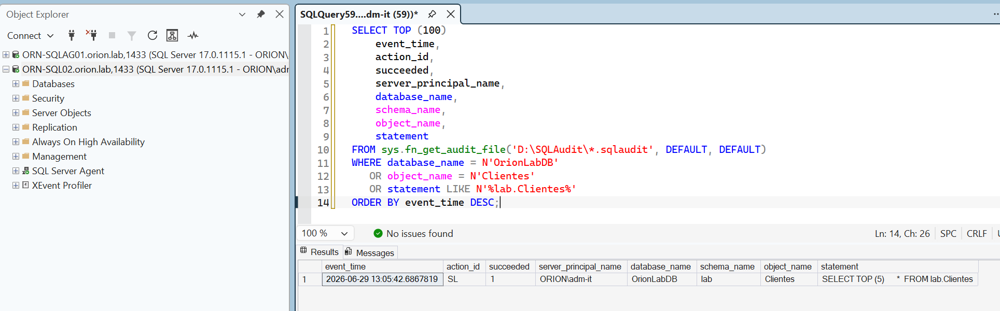
---
## 06 — Validación final
### Snapshot final de cumplimiento en SQL01.

### Snapshot final de cumplimiento en SQL02.

---
## Tabla resumen de evidencias
| Bloque | Captura | Valor técnico |
|---|---|---|
| `01-preflight-baseline` | [pf-01-dns.png](capturas/01-preflight-baseline/pf-01-dns.png) | Validación DNS del dominio y recursos críticos. |
| `01-preflight-baseline` | [pf-02-puertos-criticos.png](capturas/01-preflight-baseline/pf-02-puertos-criticos.png) | Validación de puertos SQL Server, HADR y WSFC. |
| `01-preflight-baseline` | [pf-03-listener-properties.png](capturas/01-preflight-baseline/pf-03-listener-properties.png) | Conexión al listener y propiedades principales. |
| `01-preflight-baseline` | [ag-01-availability-group-health.png](capturas/01-preflight-baseline/ag-01-availability-group-health.png) | Estado general del Availability Group. |
| `01-preflight-baseline` | [ag-02-orionlabdb-synchronized.png](capturas/01-preflight-baseline/ag-02-orionlabdb-synchronized.png) | Base OrionLabDB sincronizada dentro del AG. |
| `01-preflight-baseline` | [job-01-jobs-ag-aware-sql01.png](capturas/01-preflight-baseline/job-01-jobs-ag-aware-sql01.png) | Jobs AG-aware en SQL01. |
| `01-preflight-baseline` | [job-02-jobs-ag-aware-sql02.png](capturas/01-preflight-baseline/job-02-jobs-ag-aware-sql02.png) | Jobs AG-aware en SQL02. |
| `02-security-baseline` | [sec-01-sql02-sa-enabled-baseline.png](capturas/02-security-baseline/sec-01-sql02-sa-enabled-baseline.png) | Hallazgo inicial: sa habilitado en SQL02. |
| `02-security-baseline` | [sec-02-logins-sql01.png](capturas/02-security-baseline/sec-02-logins-sql01.png) | Inventario de logins en SQL01. |
| `02-security-baseline` | [sec-03-logins-sql02.png](capturas/02-security-baseline/sec-03-logins-sql02.png) | Inventario de logins en SQL02. |
| `03-surface-area` | [hrd-01-sa-disabled-sql02.png](capturas/03-surface-area/hrd-01-sa-disabled-sql02.png) | sa deshabilitado en SQL02. |
| `03-surface-area` | [hrd-02-sql02-post-hardening.png](capturas/03-surface-area/hrd-02-sql02-post-hardening.png) | Validación post-hardening en SQL02. |
| `03-surface-area` | [hrd-03-surface-area-sql01.png](capturas/03-surface-area/hrd-03-surface-area-sql01.png) | Superficie de ataque reducida en SQL01. |
| `05-auditoria` | [aud-01-server-audit-sql01.png](capturas/05-auditoria/aud-01-server-audit-sql01.png) | Auditoría de servidor activa en SQL01. |
| `05-auditoria` | [aud-02-server-audit-sql02.png](capturas/05-auditoria/aud-02-server-audit-sql02.png) | Auditoría de servidor activa en SQL02. |
| `05-auditoria` | [aud-03-audit-guid-aligned.png](capturas/05-auditoria/aud-03-audit-guid-aligned.png) | Audit GUID alineado entre réplicas. |
| `05-auditoria` | [aud-04-database-audit-spec.png](capturas/05-auditoria/aud-04-database-audit-spec.png) | Database Audit Specification sobre lab.Clientes. |
| `05-auditoria` | [aud-05-events-lab-clientes-sql01.png](capturas/05-auditoria/aud-05-events-lab-clientes-sql01.png) | Eventos auditados sobre lab.Clientes en SQL01. |
| `05-auditoria` | [aud-06-events-lab-clientes-sql02.png](capturas/05-auditoria/aud-06-events-lab-clientes-sql02.png) | Eventos auditados sobre lab.Clientes en SQL02. |
| `04-logins-roles-permissions` | [priv-01-readonly-user-validation.png](capturas/04-logins-roles-permissions/priv-01-readonly-user-validation.png) | Validación de mínimo privilegio: usuario readonly. |
| `04-logins-roles-permissions` | [priv-02-audit-user-validation.png](capturas/04-logins-roles-permissions/priv-02-audit-user-validation.png) | Validación de mínimo privilegio: usuario auditor. |
| `04-logins-roles-permissions` | [priv-03-backup-operator-validation.png](capturas/04-logins-roles-permissions/priv-03-backup-operator-validation.png) | Validación de mínimo privilegio: backup operator. |
| `04-logins-roles-permissions` | [priv-04-backup-file-generated.png](capturas/04-logins-roles-permissions/priv-04-backup-file-generated.png) | Fichero de backup generado por backup operator. |
| `06-validacion-final` | [fin-01-final-snapshot-sql01.png](capturas/06-validacion-final/fin-01-final-snapshot-sql01.png) | Snapshot final de cumplimiento en SQL01. |
| `06-validacion-final` | [fin-02-final-snapshot-sql02.png](capturas/06-validacion-final/fin-02-final-snapshot-sql02.png) | Snapshot final de cumplimiento en SQL02. |

## Estado

Evidencias seleccionadas, organizadas y listas para publicación en GitHub.

## Diagramas publicados

| Nº | Diagrama | Evidencia |
|---:|---|---|
| 01 | [portada-lab03-sqlserver-hardening](diagramas/01-lab03-sqlserver-hardening-cover.png) | Portada visual del LAB-03. |
| 02 | [topologia-logica-global-lab03](diagramas/02-lab03-topologia-logica-global.png) | Topología lógica global del entorno LAB-03. |

