# LAB-04 — Monitoring Stack for SQL Server & Windows

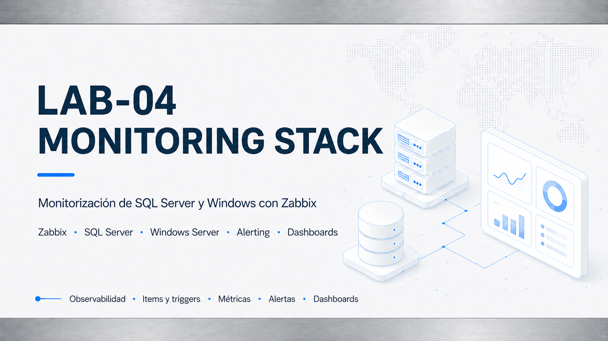

## Objetivo

Implementar un stack de monitorización centralizada para SQL Server, Windows Server y Always On Availability Groups, partiendo de una validación nativa del entorno y evolucionando hacia Zabbix Server con checks SQL custom, items, triggers y evidencias reproducibles.

## Alcance completado

- Monitorización nativa Windows / SQL Server.
- Performance Counters y PerfMon / logman.
- SQL Server DMVs, SQL Error Log y Windows Event Log.
- Validación de DNS, dominio, clúster, listener y Always On.
- Despliegue de ORN-MON01 con Ubuntu Server y Zabbix Server 7.0 LTS.
- Instalación de Zabbix Agent 2 en los nodos Windows principales.
- Monitorización base Windows con `Windows by Zabbix agent`.
- Checks SQL custom mediante Zabbix Agent 2, PowerShell y Windows Authentication.
- Template reutilizable `ORION SQL Server Custom Checks`.
- 10 items SQL custom por nodo SQL.
- 8 triggers SQL custom.
- Lógica primary-only para backups en Always On.
- Alerta real por LOG backup antiguo en el primario y recuperación tras backup LOG manual.
- Export del template Zabbix a YAML.
- Manifest y script de extracción de evidencias visuales seleccionadas.

## Arquitectura visual

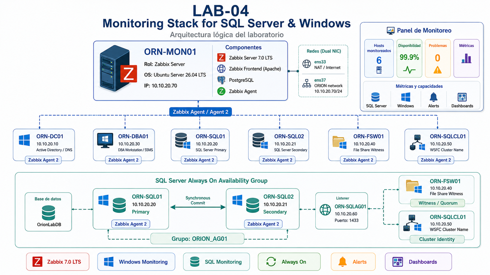

## Entorno

| Máquina | Rol | IP |
|---|---|---:|
| ORN-DC01 | Domain Controller / DNS | 10.10.20.10 |
| ORN-SQL01 | SQL Server primary replica | 10.10.20.20 |
| ORN-SQL02 | SQL Server secondary replica | 10.10.20.21 |
| ORN-SQLCL01 | WSFC Cluster Name | 10.10.20.50 |
| ORN-SQLAG01 | Always On Listener | 10.10.20.60 |
| ORN-FSW01 | File Share Witness | 10.10.20.40 |
| ORN-DBA01 | DBA workstation | 10.10.20.30 |
| ORN-MON01 | Zabbix Server | 10.10.20.70 |

## Estado final

| Bloque | Estado | Resultado |
|---|---|---|
| BLOQUE 0 — Preflight | Completado | RAM, DNS, puertos, Always On, backups, jobs, auditoría y hardening validados. |
| BLOQUE 1 — Monitorización nativa | Completado | Get-Counter, PerfMon, DMVs, Error Log, Event Log y clúster validados. |
| BLOQUE 2 — ORN-MON01 | Completado | Ubuntu Server desplegado, actualizado y preparado. |
| BLOQUE 3 — Zabbix Server | Completado | Zabbix Server 7.0.27, PostgreSQL, Apache, PHP-FPM y frontend operativos. |
| BLOQUE 4 — Zabbix Agents | Completado | Nodos Windows monitorizados con Zabbix Agent 2 y ZBX verde. |
| BLOQUE 5 — SQL custom monitoring | Completado | UserParameters, wrapper PowerShell y checks SQL validados con zabbix_get. |
| BLOQUE 6 — Template, items, triggers y evidencias | Completado | Template exportado, items y triggers creados, alerta real generada y recuperada. |
| BLOQUE 7 — Cierre documental | Completado | Documentación auxiliar, valor profesional, lecciones y roadmap alineados. |

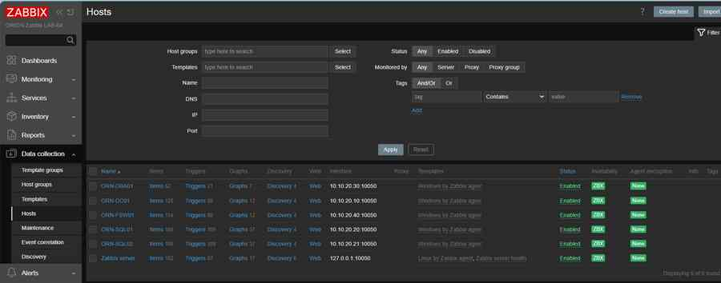

## Resultado operativo

| Elemento | Resultado |
|---|---|
| Zabbix Server | ORN-MON01 operativo |
| Versión Zabbix | 7.0.27 |
| Hosts Windows monitorizados | ORN-DC01, ORN-FSW01, ORN-DBA01, ORN-SQL01, ORN-SQL02 |
| Disponibilidad Zabbix | ZBX verde en hosts principales |
| Template base Windows | Windows by Zabbix agent |
| Template SQL custom | ORION SQL Server Custom Checks |
| Items SQL custom | 10 por nodo SQL |
| Triggers SQL custom | 8 |
| Export template | `scripts/zabbix/template-orion-sqlserver-custom.yaml` |
| Validación real | Problema SQL LOG backup old generado y resuelto |
| Estado final SQL custom | Sin problemas SQL custom activos |

## Checks SQL custom validados

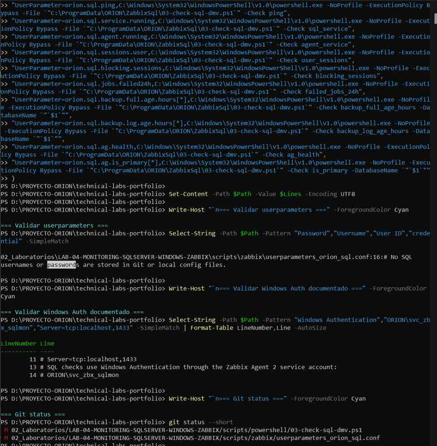

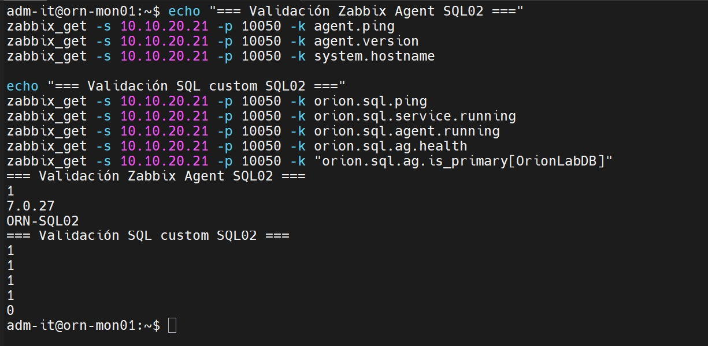

## Items SQL custom

| Item | Key | Resultado esperado |
|---|---|---:|
| SQL custom ping | `orion.sql.ping` | 1 |
| SQL Server service running | `orion.sql.service.running` | 1 |
| SQL Server Agent running | `orion.sql.agent.running` | 1 |
| SQL user sessions | `orion.sql.sessions.user` | valor numérico |
| SQL blocking sessions | `orion.sql.blocking.sessions` | 0 |
| SQL Agent failed jobs last 24h | `orion.sql.jobs.failed24h` | 0 |
| SQL backup FULL age hours for OrionLabDB | `orion.sql.backup.full.age.hours[OrionLabDB]` | según política |
| SQL backup LOG age hours for OrionLabDB | `orion.sql.backup.log.age.hours[OrionLabDB]` | según política |
| Always On health | `orion.sql.ag.health` | 1 |
| Always On is primary for OrionLabDB | `orion.sql.ag.is_primary[OrionLabDB]` | 1 en primario, 0 en secundario |

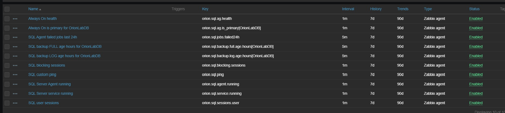

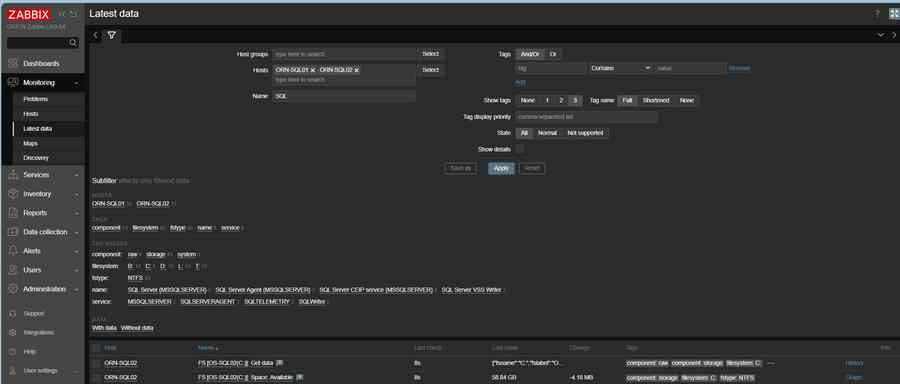

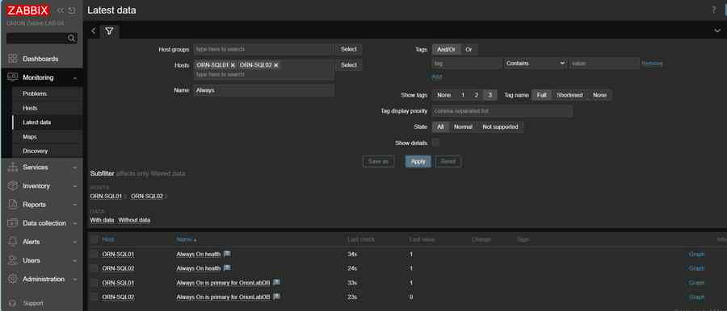

## Triggers SQL custom

| Trigger | Severidad | Objetivo |
|---|---|---|
| SQL custom ping failed on `{HOST.NAME}` | High | Detectar fallo general del check SQL custom. |
| SQL Server service down on `{HOST.NAME}` | Disaster | Detectar SQL Server Database Engine detenido. |
| SQL Server Agent down on `{HOST.NAME}` | High | Detectar SQL Server Agent detenido. |
| Always On unhealthy on `{HOST.NAME}` | High | Detectar estado no saludable del AG. |
| SQL blocking sessions detected on `{HOST.NAME}` | Warning | Detectar bloqueos SQL sostenidos. |
| SQL Agent failed jobs detected on `{HOST.NAME}` | Average | Detectar jobs fallidos en 24 horas. |
| SQL FULL backup old for OrionLabDB on `{HOST.NAME}` | Average | Alertar por FULL antiguo solo en primario. |
| SQL LOG backup old for OrionLabDB on `{HOST.NAME}` | Average | Alertar por LOG antiguo solo en primario. |

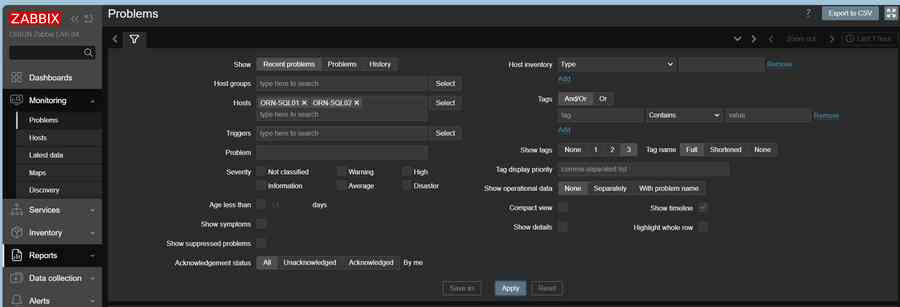

## Diseño anti-falsos positivos

Los triggers de backups incluyen lógica primary-only:

```text
last(/ORION SQL Server Custom Checks/orion.sql.ag.is_primary[OrionLabDB])=1
```

Esto evita que ORN-SQL02, como réplica secundaria, genere alertas por antigüedad de backups cuando el control operativo se valida en el primario.

## Validación real de alerta y recuperación

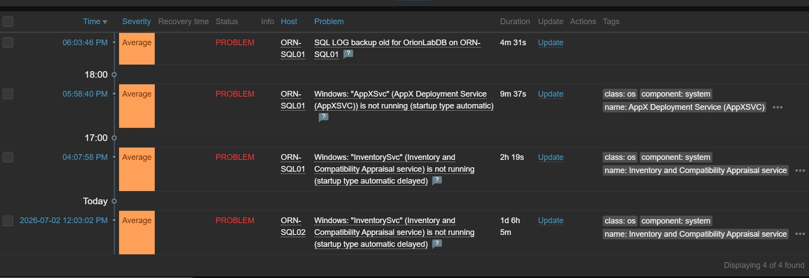

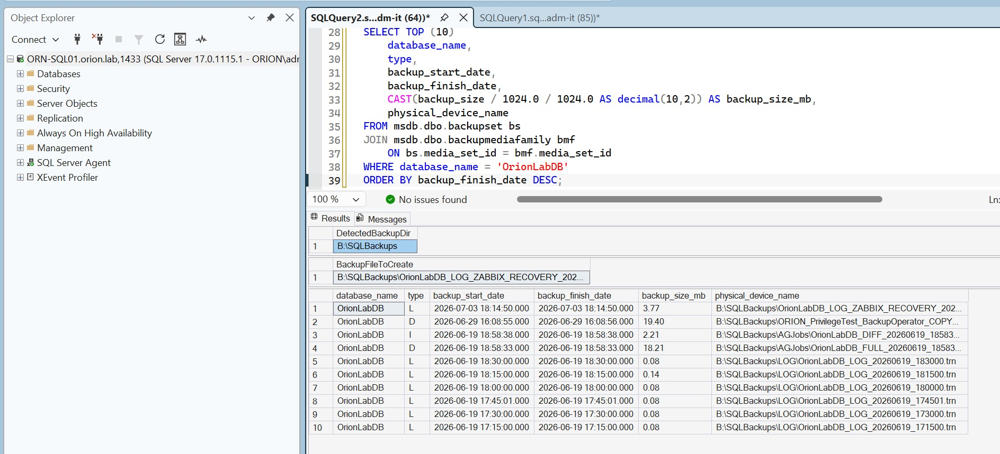

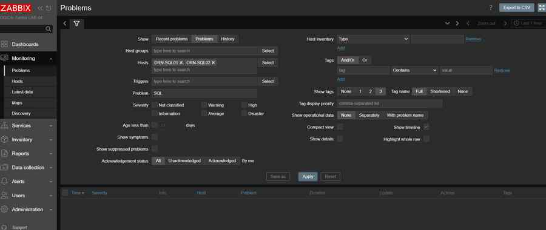

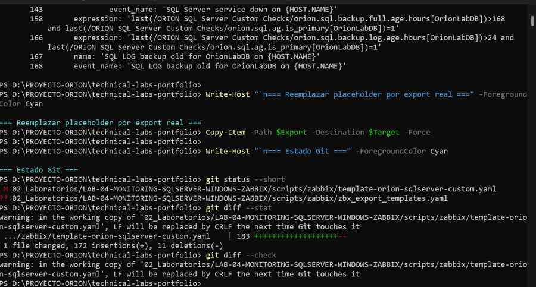

## Diagramas y evidencias

Los diagramas finales y las evidencias seleccionadas se encuentran en:

- [Diagramas LAB-04](diagramas/README.md)
- [Esquema lógico Mermaid](esquema-logico.md)
- [Evidencias LAB-04](evidencias/README.md)
- [Manifest de capturas](evidencias/manifest.md)
- [Script de extracción](scripts/powershell/09-extract-lab04-evidence-images.ps1)

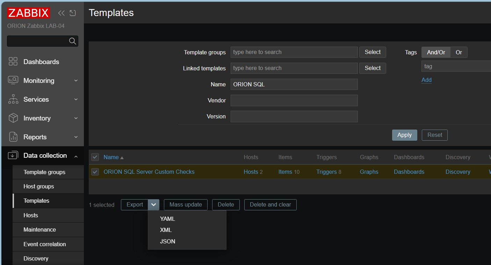

Las capturas seleccionadas se generan desde el documento técnico local del laboratorio y deben revisarse visualmente antes de publicarse.

## Documentación relacionada

| Documento | Contenido |
|---|---|
| [Arquitectura](arquitectura.md) | Diseño lógico del stack de monitorización, flujos, red y autenticación. |
| [Esquema lógico Mermaid](esquema-logico.md) | Esquema lógico renderizable en GitHub, complementario al diagrama visual final. |
| [Tecnologías](tecnologias.md) | Stack utilizado: Zabbix, Ubuntu, PostgreSQL, Windows, SQL Server, PowerShell y DMVs. |
| [Plan de trabajo](plan-trabajo.md) | Bloques ejecutados y criterios de cierre. |
| [Monitorización nativa](monitorizacion-nativa.md) | Baseline Windows / SQL Server. |
| [Zabbix Server](zabbix-server.md) | Despliegue y validación de ORN-MON01. |
| [Zabbix Agents](zabbix-agents.md) | Instalación y validación de agentes. |
| [SQL Server Monitoring](sqlserver-monitoring.md) | Checks SQL custom y validaciones. |
| [Checks custom con DMVs](checks-custom-dmv.md) | Diseño de UserParameters, wrapper PowerShell y métricas SQL. |
| [Alertas y triggers](alertas-triggers.md) | Triggers, lógica primary-only y recuperación real. |
| [Dashboards](dashboards.md) | Vistas Zabbix usadas y mejora futura de dashboard ejecutivo. |
| [Validaciones](validaciones.md) | Estado final validado. |
| [Triggers SQL custom](scripts/zabbix/triggers-documentation.md) | Items, triggers y recuperación real. |
| [Evidencias](evidencias/README.md) | Manifest y extracción de capturas. |
| [Cierre documental](cierre-lab04.md) | Resumen final del laboratorio. |
| [Troubleshooting](troubleshooting.md) | Incidencias y resolución. |
| [Valor profesional](valor-profesional.md) | Competencias demostradas. |
| [Lecciones aprendidas](lecciones-aprendidas.md) | Aprendizajes técnicos y mejoras futuras. |
| [Scripts](scripts/README.md) | Scripts SQL, PowerShell y Zabbix. |

## Estado de cierre

LAB-04 queda cerrado como **Completado v1**.

Mejoras futuras no bloqueantes:

- Crear un dashboard visual específico para dirección/operación si se quiere una vista ejecutiva adicional.
- Homogeneizar la cuenta del servicio Zabbix Agent 2 en ORN-SQL01 si se decide mantener el mismo modelo que ORN-SQL02.
- Programar jobs AG-aware de backup si el laboratorio queda encendido de forma recurrente.
- Ajustar triggers ruidososos del template Windows genérico si se quieren limpiar eventos no relacionados con SQL custom.
