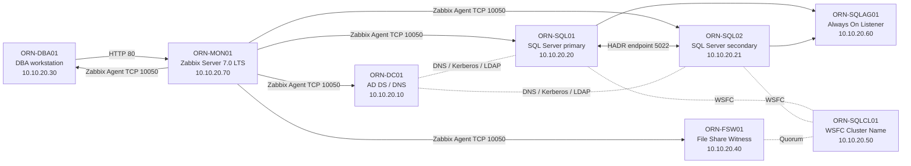

# Arquitectura LAB-04

## Objetivo

Definir la arquitectura lógica del stack de monitorización desplegado para supervisar Windows Server, SQL Server y Always On Availability Groups dentro del laboratorio.

LAB-04 reutiliza la plataforma construida en LAB-01, LAB-02 y LAB-03, incorporando una capa centralizada de operación con Zabbix Server y checks SQL custom.

## Vista lógica



## Componentes principales

| Componente | Rol |
|---|---|
| ORN-MON01 | Servidor central de monitorización con Zabbix Server, frontend, PostgreSQL, Apache y agente local. |
| ORN-DC01 | Controlador de dominio y DNS interno del laboratorio. |
| ORN-SQL01 | Nodo SQL Server principal habitual del Availability Group. |
| ORN-SQL02 | Nodo SQL Server secundario habitual del Availability Group. |
| ORN-SQLAG01 | Listener Always On utilizado para acceso lógico a la base protegida. |
| ORN-SQLCL01 | Nombre del Windows Server Failover Cluster. |
| ORN-FSW01 | File Share Witness para quorum. |
| ORN-DBA01 | Estación de administración, SSMS, navegador y validaciones operativas. |

## Red

| Elemento | Valor |
|---|---|
| Dominio | `orion.lab` |
| Red interna | `10.10.20.0/24` |
| DNS interno | `10.10.20.10` |
| Zabbix Server | `10.10.20.70` |
| Frontend Zabbix | `http://10.10.20.70/zabbix/` |
| Puerto Zabbix Agent | `10050/TCP` |
| Puerto Zabbix Server | `10051/TCP` |
| Puerto SQL Server | `1433/TCP` |
| Puerto HADR | `5022/TCP` |
| Puerto WSFC | `3343/TCP` |

## Flujo de monitorización

1. Zabbix Server consulta agentes Windows mediante TCP 10050.
2. Zabbix Agent 2 recoge métricas base de sistema operativo mediante la plantilla `Windows by Zabbix agent`.
3. En los nodos SQL, Zabbix Agent 2 ejecuta UserParameters SQL custom.
4. Los UserParameters llaman al wrapper PowerShell `03-check-sql-dmv.ps1`.
5. El wrapper ejecuta consultas T-SQL con Windows Authentication y devuelve un único valor numérico por check.
6. Zabbix guarda los valores como items, aplica triggers y genera problemas cuando se supera una condición.
7. La recuperación se valida cuando el item vuelve a un valor correcto y el problema pasa a `RESOLVED`.

## Diseño de autenticación

Los checks SQL custom se diseñan para evitar usuarios SQL y secretos en Git.

| Elemento | Decisión |
|---|---|
| Modo SQL Server | Windows Authentication Only, heredado del LAB-03. |
| Credenciales SQL | No se versionan usuarios ni contraseñas SQL. |
| Config local | `Server=tcp:localhost,1433`. |
| Cuenta técnica | `ORION\svc_zbx_sqlmon` donde es viable. |
| Excepción documentada | ORN-SQL01 queda temporalmente con Zabbix Agent 2 en LocalSystem, con checks validados. |

## Diseño anti-falsos positivos

En Always On no todos los checks deben alertar igual en primario y secundario.

Por ese motivo, los triggers de backup usan lógica `primary-only` con el item:

```text
orion.sql.ag.is_primary[OrionLabDB]
```

Esto evita que ORN-SQL02 genere alertas de backup cuando actúa como réplica secundaria.

## Capas de monitorización

| Capa | Herramientas | Objetivo |
|---|---|---|
| Nativa | Get-Counter, PerfMon, logman, SQL DMVs, SQL Error Log, Windows Event Log | Validar baseline antes de centralizar. |
| Centralizada | Zabbix Server, Zabbix Agent 2, template Windows | Supervisar hosts, servicios, disponibilidad y recursos. |
| SQL custom | UserParameters, PowerShell, DMVs, msdb, HADR views | Monitorizar salud SQL Server, jobs, backups, bloqueos y Always On. |
| Operativa | Items, triggers, Problems, Latest data, evidencias | Detectar, corregir y demostrar recuperación real. |

## Conclusión

La arquitectura final integra monitorización clásica y centralizada sin romper el hardening del LAB-03, manteniendo Windows Authentication y añadiendo checks DBA específicos sobre SQL Server Always On.
