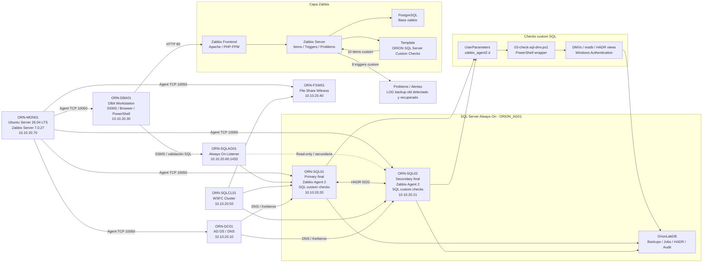

# Esquema lógico — LAB-04 Monitoring Stack for SQL Server & Windows

## Objetivo

Añadir un esquema lógico renderizable directamente en GitHub mediante Mermaid, manteniendo la portada, el diagrama de arquitectura final y las evidencias existentes.

La imagen publicada se conserva en:

```text
diagramas/lab04_diagrama_de_arquitectura.png
```

## Esquema lógico Mermaid



## Lectura rápida

- ORN-MON01 centraliza Zabbix Server, frontend, PostgreSQL e items/triggers.
- Los nodos SQL ejecutan Zabbix Agent 2 y UserParameters.
- Los checks SQL custom convierten DMVs y `msdb` en métricas Zabbix.
- La lógica primary-only evita falsos positivos de backups en la réplica secundaria.
- El lab valida un ciclo real: métrica → trigger → problema → backup correctivo → recuperación.
