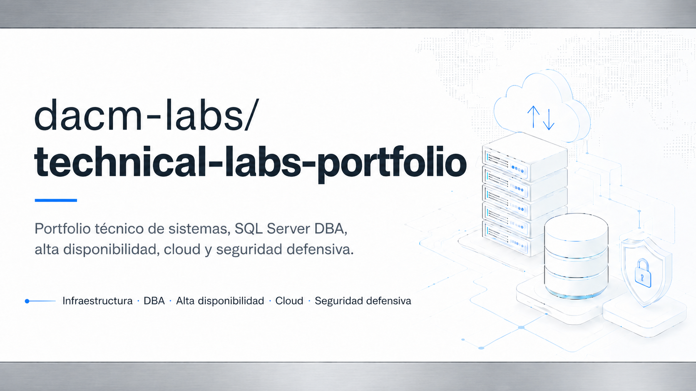

# Portfolio técnico — Sistemas, SQL Server, Cloud y Seguridad Defensiva




## Presentación

Este repositorio recoge un **portfolio técnico documentado** orientado a sistemas, infraestructura IT, administración de bases de datos, alta disponibilidad, ciberseguridad defensiva, monitorización y automatización.

El objetivo es demostrar capacidad práctica para diseñar, desplegar, validar y documentar laboratorios realistas, con evidencias reproducibles y una progresión técnica coherente.

El nombre interno del entorno de prácticas se conserva únicamente en algunos nombres técnicos del laboratorio. De cara pública, este repositorio se presenta como un portfolio técnico profesional, claro y orientado a empleabilidad.

**Nota sobre nomenclatura interna:** nombres como `orion.lab`, `ORN-*`, `ORION_AG01` o similares forman parte del esquema interno usado para ordenar máquinas, dominio, recursos y evidencias del laboratorio. No representan una marca pública ni una infraestructura real de producción.

---

## Lectura rápida para recruiters

Competencias demostradas en los laboratorios publicados:

- Administración de sistemas Windows/Linux.
- SQL Server DBA: instalación, backup, recovery, seguridad, auditoría y monitorización.
- Alta disponibilidad con SQL Server Always On Availability Groups y Windows Server Failover Cluster.
- Hardening SQL Server, auditoría, trazabilidad y mínimo privilegio sobre entorno HADR.
- Monitorización centralizada con Zabbix Server, Zabbix Agent 2, UserParameters y checks SQL custom.
- Ciberseguridad defensiva, segmentación de red, Active Directory, pfSense y Wazuh.
- Operación IT, troubleshooting, continuidad de servicio y documentación técnica.
- Automatización y validación con PowerShell, T-SQL y evidencias reproducibles.

Este portfolio está pensado para mostrar trabajo técnico realista, documentación clara, resolución de incidencias y criterio operativo en entornos de laboratorio cercanos a escenarios profesionales.

### Roles objetivo

Este repositorio puede apoyar candidaturas orientadas a:

- Administrador de sistemas junior / técnico de sistemas.
- DBA SQL Server junior.
- Técnico de infraestructura Windows / Active Directory.
- Técnico de soporte avanzado / operación IT.
- Perfil junior de ciberseguridad defensiva, Blue Team o SOC.
- Técnico cloud junior con base de sistemas, seguridad y datos.

---

## Enfoque actual

La línea principal del portfolio se centra en:

```text
SQL Server DBA + infraestructura Windows + seguridad + monitorización + alta disponibilidad
```

La secuencia técnica actual queda orientada así:

```text
LAB-00 AÉGIDA → LAB-01 SQL Server DBA → LAB-02 Always On → LAB-03 Hardening/Audit → LAB-04 Monitoring → AD/SOC/Cloud
```

---

## Laboratorios

| Laboratorio | Estado | Área principal | Descripción |
|---|---|---|---|
| [LAB-00 — AÉGIDA Case Study](02_Laboratorios/LAB-00-AEGIDA-CASE-STUDY) | Completado v1 | Ciberseguridad defensiva / Blue Team | Arquitectura segmentada con pfSense, Active Directory, PAW, Wazuh, DMZ, OT simulado y RED-KALI. |
| [LAB-01 — SQL Server DBA Backup, Recovery, Security, Monitoring & Maintenance](02_Laboratorios/LAB-01-SQLSERVER-DBA-BACKUP-SECURITY) | Completado v1 | SQL Server / DBA / Seguridad / Monitorización | SQL Server 2025 en dominio con backup, restore, PITR, SQL Agent, Database Mail, alertas, mínimo privilegio, auditoría, Query Store y dashboard DBA. |
| [LAB-02 — SQL Server Always On Availability Groups](02_Laboratorios/LAB-02-SQLSERVER-ALWAYS-ON-HADR) | Completado v1 | SQL Server / Alta disponibilidad / HA-DR | WSFC, File Share Witness, Availability Group, listener, failover, failback, lectura en secundaria, jobs AG-aware y validación final de continuidad. |
| [LAB-03 — SQL Server Hardening, Audit & Compliance](02_Laboratorios/LAB-03-SQLSERVER-HARDENING-AUDIT-COMPLIANCE) | Completado v1 | SQL Server / Seguridad / Auditoría / Compliance | Hardening de SQL Server Always On, Windows-only, `sa` deshabilitado, auditoría de servidor y base de datos, trazabilidad y validación de mínimo privilegio con usuarios reales. |
| [LAB-04 — Monitoring Stack for SQL Server & Windows](02_Laboratorios/LAB-04-MONITORING-SQLSERVER-WINDOWS-ZABBIX) | Completado v1 | Monitorización / Operación / SQL Server | Zabbix Server 7.0 LTS, Zabbix Agent 2, monitorización Windows, checks SQL custom, template reutilizable, items, triggers, alerta real recuperada y evidencias visuales. |

---

## LAB-00 — AÉGIDA Case Study

Caso de estudio basado en una arquitectura defensiva segmentada que integra pfSense, Active Directory, PAW, GPOs, DMZ, Wazuh, FIM y un entorno OT simulado.

Documentación principal:

| Documento | Contenido |
|---|---|
| [README del laboratorio](02_Laboratorios/LAB-00-AEGIDA-CASE-STUDY/README.md) | Presentación general del case study. |
| [Arquitectura](02_Laboratorios/LAB-00-AEGIDA-CASE-STUDY/arquitectura.md) | Diseño técnico, redes, zonas y flujos. |
| [Evidencias](02_Laboratorios/LAB-00-AEGIDA-CASE-STUDY/evidencias.md) | Capturas, diagramas y validaciones visuales. |
| [Tecnologías](02_Laboratorios/LAB-00-AEGIDA-CASE-STUDY/tecnologias.md) | Stack tecnológico utilizado. |
| [Competencias técnicas](02_Laboratorios/LAB-00-AEGIDA-CASE-STUDY/valor-profesional.md) | Competencias demostradas y aplicación técnica. |
| [Lecciones aprendidas](02_Laboratorios/LAB-00-AEGIDA-CASE-STUDY/lecciones-aprendidas.md) | Incidencias, mejoras y aprendizaje técnico. |

---

## LAB-01 — SQL Server DBA

LAB-01 construye una base de administración SQL Server sobre dominio Windows.

Incluye Active Directory, servidor SQL dedicado, estación administrativa DBA, SQL Server 2025, discos separados, backups FULL/DIFF/LOG, restore completo, point-in-time recovery, reparación de datos, SQL Server Agent, Database Mail, alertas, mínimo privilegio, auditoría, Query Store y dashboard DBA.

Documentación principal:

| Documento | Contenido |
|---|---|
| [README del laboratorio](02_Laboratorios/LAB-01-SQLSERVER-DBA-BACKUP-SECURITY/README.md) | Visión general, estado final y estructura. |
| [Arquitectura](02_Laboratorios/LAB-01-SQLSERVER-DBA-BACKUP-SECURITY/arquitectura.md) | Diseño de máquinas, red, discos y flujos. |
| [Tecnologías](02_Laboratorios/LAB-01-SQLSERVER-DBA-BACKUP-SECURITY/tecnologias.md) | Stack técnico utilizado. |
| [Backup y recovery](02_Laboratorios/LAB-01-SQLSERVER-DBA-BACKUP-SECURITY/backup-recovery.md) | Backups, restores, PITR, reparación y jobs. |
| [Seguridad](02_Laboratorios/LAB-01-SQLSERVER-DBA-BACKUP-SECURITY/seguridad.md) | Grupos AD, logins, roles y mínimo privilegio. |
| [Auditoría y monitorización](02_Laboratorios/LAB-01-SQLSERVER-DBA-BACKUP-SECURITY/auditoria-monitorizacion.md) | Correo SQL, avisos de jobs y eventos. |
| [Dashboard DBA](02_Laboratorios/LAB-01-SQLSERVER-DBA-BACKUP-SECURITY/dashboard-dba.md) | Vistas DBA, Query Store y salud final del entorno. |
| [Evidencias](02_Laboratorios/LAB-01-SQLSERVER-DBA-BACKUP-SECURITY/evidencias.md) | Galería visual de capturas y pruebas. |
| [Competencias técnicas](02_Laboratorios/LAB-01-SQLSERVER-DBA-BACKUP-SECURITY/valor-profesional.md) | Competencias demostradas. |
| [Lecciones aprendidas](02_Laboratorios/LAB-01-SQLSERVER-DBA-BACKUP-SECURITY/lecciones-aprendidas.md) | Incidencias, troubleshooting y mejoras. |

---

## LAB-02 — SQL Server Always On Availability Groups

LAB-02 amplía LAB-01 hacia alta disponibilidad y continuidad de servicio con **Windows Server Failover Cluster** y **SQL Server Always On Availability Groups**.

Incluye:

- Reutilización de la base `orion.lab` construida en LAB-01.
- Segundo nodo SQL Server `ORN-SQL02`.
- File Share Witness `ORN-FSW01`.
- Clúster WSFC `ORN-SQLCL01`.
- Availability Group `ORION_AG01`.
- Listener `ORN-SQLAG01` con IP `10.10.20.60` y puerto `1433`.
- Endpoint HADR en puerto `5022`.
- Modo `SYNCHRONOUS_COMMIT` y failover manual.
- Lectura en réplica secundaria mediante `ApplicationIntent=ReadOnly`.
- Failover, failback, parada controlada, recuperación y resincronización.
- Jobs AG-aware adaptados al rol de cada réplica.
- Validación final de DNS y puertos `1433`, `5022` y `3343`.

Documentación principal:

| Documento | Contenido |
|---|---|
| [README del laboratorio](02_Laboratorios/LAB-02-SQLSERVER-ALWAYS-ON-HADR/README.md) | Visión general, arquitectura final y estado validado. |
| [Arquitectura](02_Laboratorios/LAB-02-SQLSERVER-ALWAYS-ON-HADR/arquitectura.md) | Nodos, red, quorum, listener y diseño HA. |
| [Tecnologías](02_Laboratorios/LAB-02-SQLSERVER-ALWAYS-ON-HADR/tecnologias.md) | Stack técnico utilizado. |
| [Plan de trabajo](02_Laboratorios/LAB-02-SQLSERVER-ALWAYS-ON-HADR/plan-trabajo.md) | Fases ejecutadas. |
| [Checklist](02_Laboratorios/LAB-02-SQLSERVER-ALWAYS-ON-HADR/checklist.md) | Validaciones completadas. |
| [Validaciones](02_Laboratorios/LAB-02-SQLSERVER-ALWAYS-ON-HADR/validaciones.md) | Estado final de Always On, WSFC, DNS, puertos y jobs AG-aware. |
| [Troubleshooting](02_Laboratorios/LAB-02-SQLSERVER-ALWAYS-ON-HADR/troubleshooting.md) | Incidencias encontradas y resolución. |
| [Evidencias](02_Laboratorios/LAB-02-SQLSERVER-ALWAYS-ON-HADR/evidencias.md) | Capturas seleccionadas publicadas. |
| [Lecciones aprendidas](02_Laboratorios/LAB-02-SQLSERVER-ALWAYS-ON-HADR/lecciones-aprendidas.md) | Aprendizajes técnicos del laboratorio. |

---

## LAB-03 — SQL Server Hardening, Audit & Compliance

LAB-03 toma el entorno Always On de LAB-02 y lo convierte en una plataforma más segura, auditable y validada desde el punto de vista de cumplimiento.

Incluye:

- Preflight de DNS, puertos, listener, Always On y jobs AG-aware.
- Baseline de seguridad en SQL01 y SQL02.
- Corrección de asimetrías de hardening.
- SQL01 y SQL02 en Windows Authentication only.
- Login `sa` deshabilitado en ambos nodos.
- Reducción de superficie de ataque.
- Auditoría de servidor activa en ambos nodos.
- Alineación de `audit_guid` entre réplicas.
- Auditoría de base de datos sobre `OrionLabDB.lab.Clientes`.
- Registro de eventos `SELECT`, `INSERT`, `UPDATE` y `DELETE`.
- Validación de mínimo privilegio con usuarios reales.
- Checklist final de cumplimiento en ambos nodos.

Documentación principal:

| Documento | Contenido |
|---|---|
| [README del laboratorio](02_Laboratorios/LAB-03-SQLSERVER-HARDENING-AUDIT-COMPLIANCE/README.md) | Visión general, controles aplicados y estado final. |
| [Arquitectura](02_Laboratorios/LAB-03-SQLSERVER-HARDENING-AUDIT-COMPLIANCE/arquitectura.md) | Componentes, flujo Always On, seguridad y auditoría. |
| [Tecnologías](02_Laboratorios/LAB-03-SQLSERVER-HARDENING-AUDIT-COMPLIANCE/tecnologias.md) | Stack técnico utilizado. |
| [Plan de trabajo](02_Laboratorios/LAB-03-SQLSERVER-HARDENING-AUDIT-COMPLIANCE/plan-trabajo.md) | Bloques ejecutados. |
| [Hardening](02_Laboratorios/LAB-03-SQLSERVER-HARDENING-AUDIT-COMPLIANCE/hardening.md) | Controles correctivos y validación post-hardening. |
| [Auditoría](02_Laboratorios/LAB-03-SQLSERVER-HARDENING-AUDIT-COMPLIANCE/auditoria.md) | Auditoría de servidor, base de datos, audit GUID y eventos. |
| [Mínimo privilegio](02_Laboratorios/LAB-03-SQLSERVER-HARDENING-AUDIT-COMPLIANCE/minimo-privilegio.md) | Pruebas con usuarios readonly, auditor y backup operator. |
| [Validaciones](02_Laboratorios/LAB-03-SQLSERVER-HARDENING-AUDIT-COMPLIANCE/validaciones.md) | Resultados técnicos del laboratorio. |
| [Checklist](02_Laboratorios/LAB-03-SQLSERVER-HARDENING-AUDIT-COMPLIANCE/checklist.md) | Estado final de cumplimiento. |
| [Evidencias](02_Laboratorios/LAB-03-SQLSERVER-HARDENING-AUDIT-COMPLIANCE/evidencias.md) | Relación de capturas y criterios de publicación. |
| [Troubleshooting](02_Laboratorios/LAB-03-SQLSERVER-HARDENING-AUDIT-COMPLIANCE/troubleshooting.md) | Incidencias reales y resolución. |
| [Scripts](02_Laboratorios/LAB-03-SQLSERVER-HARDENING-AUDIT-COMPLIANCE/scripts/README.md) | Scripts SQL y PowerShell de referencia. |
| [Competencias técnicas](02_Laboratorios/LAB-03-SQLSERVER-HARDENING-AUDIT-COMPLIANCE/valor-profesional.md) | Valor profesional demostrado. |
| [Lecciones aprendidas](02_Laboratorios/LAB-03-SQLSERVER-HARDENING-AUDIT-COMPLIANCE/lecciones-aprendidas.md) | Conclusiones técnicas del laboratorio. |

---

## LAB-04 — Monitoring Stack for SQL Server & Windows

LAB-04 incorpora monitorización centralizada sobre la plataforma SQL Server Always On construida en los laboratorios anteriores.

Incluye:

- Baseline de monitorización nativa Windows / SQL Server.
- Zabbix Server 7.0 LTS sobre ORN-MON01.
- Zabbix Agent 2 7.0.27 en nodos Windows.
- Monitorización base Windows con plantilla `Windows by Zabbix agent`.
- UserParameters para checks SQL custom.
- Wrapper PowerShell para checks SQL Server mediante Windows Authentication.
- Validación desde ORN-MON01 mediante `zabbix_get`.
- Template reutilizable `ORION SQL Server Custom Checks`.
- 10 items SQL custom por nodo SQL.
- 8 triggers SQL custom con lógica primary-only para backups en Always On.
- Validación real de alerta `SQL LOG backup old` en ORN-SQL01.
- Recuperación real tras backup LOG manual.
- Export YAML del template y evidencias visuales publicadas.

Documentación principal:

| Documento | Contenido |
|---|---|
| [README del laboratorio](02_Laboratorios/LAB-04-MONITORING-SQLSERVER-WINDOWS-ZABBIX/README.md) | Visión general, estado final, items, triggers y evidencias. |
| [Monitorización nativa](02_Laboratorios/LAB-04-MONITORING-SQLSERVER-WINDOWS-ZABBIX/monitorizacion-nativa.md) | Baseline Windows, SQL Server, PerfMon, DMVs y clúster. |
| [Zabbix Server](02_Laboratorios/LAB-04-MONITORING-SQLSERVER-WINDOWS-ZABBIX/zabbix-server.md) | Despliegue de ORN-MON01 y Zabbix Server. |
| [Zabbix Agents](02_Laboratorios/LAB-04-MONITORING-SQLSERVER-WINDOWS-ZABBIX/zabbix-agents.md) | Instalación y validación de agentes Windows. |
| [SQL Server Monitoring](02_Laboratorios/LAB-04-MONITORING-SQLSERVER-WINDOWS-ZABBIX/sqlserver-monitoring.md) | Checks SQL custom y validaciones contra SQL01/SQL02. |
| [Validaciones](02_Laboratorios/LAB-04-MONITORING-SQLSERVER-WINDOWS-ZABBIX/validaciones.md) | Estado validado de Zabbix, agentes, checks SQL, items y triggers. |
| [Triggers SQL custom](02_Laboratorios/LAB-04-MONITORING-SQLSERVER-WINDOWS-ZABBIX/scripts/zabbix/triggers-documentation.md) | Documentación de triggers, lógica primary-only y recuperación real. |
| [Evidencias](02_Laboratorios/LAB-04-MONITORING-SQLSERVER-WINDOWS-ZABBIX/evidencias/README.md) | Capturas seleccionadas del cierre operativo. |
| [Cierre documental](02_Laboratorios/LAB-04-MONITORING-SQLSERVER-WINDOWS-ZABBIX/cierre-lab04.md) | Conclusión final y valor profesional del laboratorio. |
| [Troubleshooting](02_Laboratorios/LAB-04-MONITORING-SQLSERVER-WINDOWS-ZABBIX/troubleshooting.md) | Incidencias reales y decisiones operativas. |
| [Scripts](02_Laboratorios/LAB-04-MONITORING-SQLSERVER-WINDOWS-ZABBIX/scripts/README.md) | Scripts SQL, PowerShell y Zabbix. |

---

## Áreas técnicas trabajadas

- Administración de sistemas Windows y Linux.
- Redes, segmentación y DNS.
- Active Directory y control de acceso.
- Seguridad perimetral y defensiva.
- Administración privilegiada.
- SQL Server DBA: backup, recovery, seguridad, auditoría y rendimiento.
- SQL Server Always On, WSFC, listener, failover y recuperación.
- Hardening SQL Server, mínimo privilegio y cumplimiento.
- Monitorización centralizada, observabilidad y operación.
- Automatización con PowerShell y T-SQL.
- Troubleshooting técnico.
- Documentación técnica.
- GitHub como portfolio técnico.

---

## Roadmap técnico

### Estado actual

| Laboratorio | Estado | Papel dentro del portfolio |
|---|---|---|
| LAB-00 — AÉGIDA Case Study | Completado v1 | Base defensiva, segmentación, AD, pfSense, Wazuh y enfoque Blue Team. |
| LAB-01 — SQL Server DBA | Completado v1 | Base DBA: instalación, backups, recovery, seguridad, jobs, auditoría y monitorización inicial. |
| LAB-02 — SQL Server Always On HADR | Completado v1 | Alta disponibilidad con WSFC, listener, failover, failback y jobs AG-aware. |
| LAB-03 — SQL Server Hardening, Audit & Compliance | Completado v1 | Endurecimiento, auditoría, trazabilidad, mínimo privilegio y checklist de cumplimiento sobre Always On. |
| LAB-04 — Monitoring Stack for SQL Server & Windows | Completado v1 | Zabbix Server, agentes Windows, checks SQL custom, template, items, triggers, alerta real, recuperación y evidencias. |

### Próximos laboratorios previstos

El roadmap prioriza laboratorios que aprovechan la plataforma ya construida y aumentan su valor operativo: Active Directory defensivo, SOC/Blue Team, automatización, cloud híbrido y datos.

| Prioridad | Línea | Laboratorio / evolución prevista | Objetivo técnico |
|---|---|---|---|
| 1 | Active Directory defensivo | LAB-05 — AD Hardening & Tiering | Reforzar identidad, administración privilegiada, Tier 0, GPOs, auditoría de cambios y control de acceso. |
| 2 | SOC / Blue Team | LAB-06 — Wazuh Detection & Response | Correlación de eventos, reglas, alertas, FIM, casos de uso defensivos y respuesta básica ante incidentes. |
| 3 | Cloud / híbrido | LAB-07 — Azure Hybrid Foundations | Conectar fundamentos cloud con identidad, backup, monitorización, seguridad y servicios híbridos. |
| 4 | Automatización | LAB-08 — PowerShell Automation for Sysadmin / DBA | Crear scripts reutilizables para inventario, reporting, validaciones, mantenimiento y operación diaria. |
| 5 | Datos / IA | LAB-09 — Data Platform & AI Foundations | Construir base de datos, pipelines, análisis con Python/SQL y preparación para proyectos de IA aplicada. |

### Criterio de continuidad

La evolución prevista no arranca laboratorios aislados: cada nuevo bloque reutiliza o amplía la infraestructura ya documentada. Tras LAB-04 Monitoring, la prioridad natural pasa a **LAB-05 AD Hardening & Tiering**, manteniendo la cadena profesional construida hasta ahora:

```text
DBA base → Alta disponibilidad → Hardening/Auditoría → Monitorización/Operación → Identidad defensiva
```

Después, el portfolio puede crecer hacia SOC/Blue Team, automatización, cloud híbrido y datos/IA sin perder coherencia técnica.
